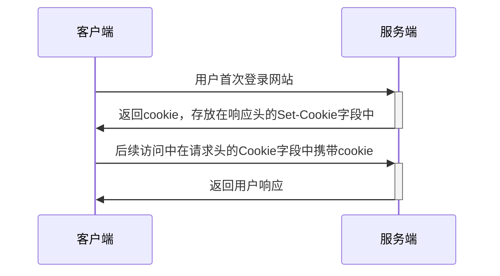
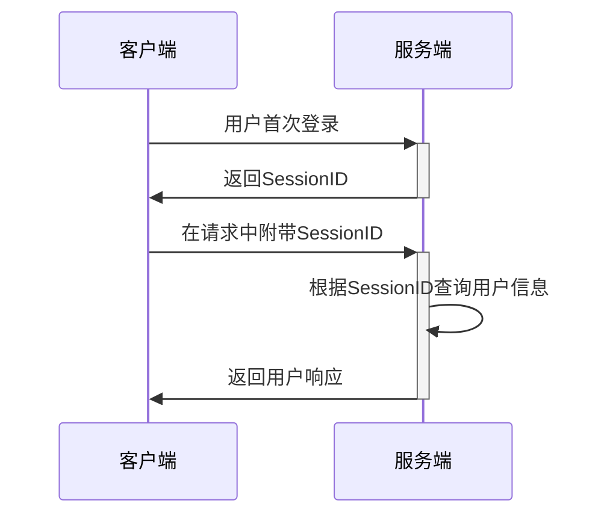
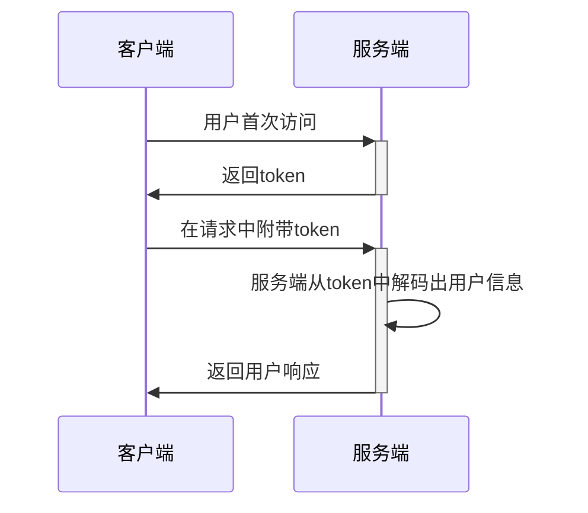

在现代 Web 应用中，用户身份认证与状态管理是构建安全、可靠系统的基础。随着前后端分离架构、单页应用（SPA）、移动端 API 调用等场景的普及，​​Cookie、Session 和 Token​​ 是三种最为常见的身份认证与状态管理机制。下面对三者的基本概念和区别进行分析

## Cookie

Cookie​ 是由 ​​Web 服务器发送到用户浏览器​​，并保存在客户端本地的一小段​文本数据​，主要用于在​客户端存储会话状态或用户相关信息​​

HTTP 是无状态协议，每次 HTTP 的请求与响应都是互不关联的。Cookie 就是为了在多次 HTTP 请求与响应中保持状态而出现的机制。当用户多次访问同一网站时，浏览器会自动将 Cookie 通过 HTTP 请求头（通常是 `Cookie` 字段）​​回传给服务器​​，从而使服务端能够识别用户身份、维持登录状态或记录用户行为

Cookie 的简单运行流程如下



Cookie 中并没有规定存储的内容，因此 Cookie 本质上只是一种**状态存储机制**。Cookie 存储信息是明文存储，若直接将用户信息存放在 Cookie 中，会非常不安全，因此出现了 Session 和 Token 两种方案来规定 Cookie 中存储的信息，保证安全性

## Session

Session 方案的核心是**由服务端来维护用户信息**。当用户首次登录网站时，服务端为用户的当前会话生成一个 SessionID，用户信息和会话状态存放在服务端，SessionID 通过 Cookie 返回给客户端，用户后续访问时，在 Cookie 中附带 SessionID，服务端即可通过 SessionID 查找到相应的用户信息和会话状态

可以将 SessionID 类比作身份证号，服务端接收到身份证号后需要根据身份证号查询出用户信息

大致运行流程如下



## Token

随着分布式服务端架构的普及，Session 方案逐渐出现了扩展性差、用户信息需要跨实例共享等问题。在微服务与多实例部署的场景下，每个服务都可能运行在不同的物理机或容器中，如果依然依赖服务端保存用户的登录状态，就需要引入复杂的 Session 同步机制，或者依赖集中式的 Session 存储，这不仅增加了系统复杂度，也带来了额外的性能开销和单点故障风险

Token 方案的核心是**由客户端来存储用户信息**。当用户首次登录网站时，服务端将必要的用户信息和其他信息编码到 token 中（这种性质也被称为自包含），通过 Cookie 返回到客户端中。用户后续访问时，将 token 通过 Cookie 发送到服务端，服务端通过签名机制验证 token 的合法性，同时解码 token，获取其中的用户信息

> Token 签名，是指服务端在生成 Token 时，使用一个密钥或密钥对​​对 Token 的部分或全部内容进行加密计算，生成一段​签名（signature）​​，并将该签名附加到 Token 中。
>
> 当客户端将 Token 发回给服务端时，服务端可以使用相同的密钥重新计算签名，然后与 Token 中携带的签名进行比对，以验证该 Token 是否被篡改、是否真的由可信的服务端签发。

Token 可以类比作身份证，服务端接收到身份证后，直接可以从中解码出用户信息

大致运行流程如下



## JWT

JWT（Json Web Token）是 Token 方案的一种实现，它基于 JSON 格式

JWT 是由 Header、Payload 和 Signature 组成的 `Header.Payload.Signature` 格式的字符串

- Header

    描述 JWT 的类型和签名算法，原始数据示例如下

    ```json
    { 
      "alg": "HS256", 
      "typ": "JWT"
    }
    ```

    以上内容经过 Base64Url 编码，生成 Header

- Payload

    存储用户信息，通常包含三类声明

    - 标准声明​​：预定义字段，如 `iss`（发行者）、`exp`（过期时间）、`sub`（主题，通常为用户 ID）、`iat`（签发时间）
    - 公共声明​​：用户自定义字段，如 `userId`、`username`、`role`
    - 私有声明​​：特定场景下使用的字段，如 `permissions`

    该部分同样经过 Base64Url 编码，生成 Payload

- Signature：签名，用于服务端进行合法性验证

    该部分由 Header 和 Payload 计算得到，用于服务端验证 JWT 的合法性，计算方法示例如下

    ```
    encode = Base64UrlEncode(Header) + "." + Base64UrlEncode(Payload)
    signature = HMACSHA256(encode, SecretKey)
    ```

    其中，SecretKey 为服务端拥有的加密私钥
