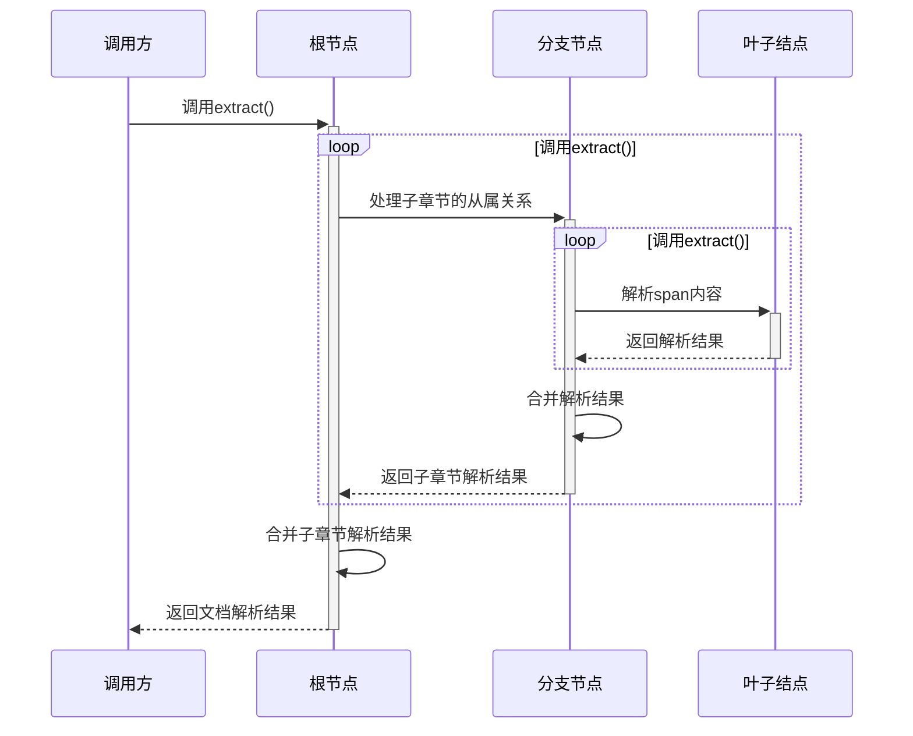

## 任务背景

本任务是使用**基于规则**的方法，将 PDF 中的信息提取出来，组合成**具有组织结构**的 json 格式

### PDF 文档的性质

PDF 文档内容可分为**文本**、**图片**、**表格**三种元素

本任务中的 PDF 文档具有以下特点

- 章节顺序稳定

    文档章节排布顺序固定，例如遵循 “第一章 引言、第二章 相关工作...” 的顺序
    
- 章节内结构一致

    同一章节的内容构成模式统一，例如 “引言” 章节仅包含**文本**元素，无**图片**与**表格**；“实验方法” 章节则同时包含文本与图片元素等
    
- 文档排版复杂度高

    存在多类复杂排版场景，例如文本未完全按自然段规整布局、表格包含多行复杂单元格，且表格可能在任意位置出现跨页分割的情况。

### PDF 解析工具分析

目前的开源 PDF 解析工具所使用的方法可以大致分为基于 PDF 结构规则的解析方法和基于深度学习模型的解析方法，以下简称为**原生解析**和**OCR 解析**

| 方法             | 说明                                | 解析速度 | 单一对象解析准确度 | 复杂排版中对象定位准确度 |
| -------------- | --------------------------------- | ---- | --------- | ------------ |
| 基于 PDF 结构规则的解析方法 | 该方法直接解析 PDF 的底层对象，如文字、线条、坐标等        | 快    | 高         | 低            |
| 基于深度学习模型的解析方法  | 该方法主要使用目标检测模型和 OCR 模型对文档中的对象进行定位与识别 | 慢    | 较高        | 较高           |

## 总体方案


总体方案主要分为两部分

- PDF 混合解析：结合 OCR 解析和原生解析，提取 PDF 文档元素
    
- 文档结构化：基于文档元素中的内容，组织文档元素，输出结构化 json

## PDF 混合解析

本任务中的 PDF 文档具有复杂排版，使用 OCR 进行排版解析，提取出文档中的文本片段、图片、表格

但 OCR 提取出的文本片段存在错字的情况，且后续文档结构化基于文档元素的内容，对文本内容的解析准确度有较高的要求，因此考虑结合原生解析对文本元素进行修正，提高对单个文档元素的识别准确度

### OCR 解析

目前开源 OCR 解析工具效果较好的是 [MinerU](https://github.com/opendatalab/mineru)，它支持配置不同的模型进行排版解析，支持公式及表格的识别，它的解析过程中会输出不同粒度的结果文件，详见 [输出文件格式 - MinerU](https://opendatalab.github.io/MinerU/zh/reference/output_files/)，以下对 `middle.json` 作说明

`middle.json` 中包含排版解析的结果，大致结构如下

```json5
{  
  // 每个元素是每一页PDF的识别结果  
  "pdf_info": [  
    {  
    // 一页中包含若干个由MinerU识别出来的内容块（block），例如文本段落、表格、图片  
      "para_blocks": [  
        {  
          "type": "text",  
          // 对于文本段落，block中包含多个行  
          "lines": [  
            {
              // 一行中包含多个片段（span），span是MinerU排版解析的最小单位  
              "spans": [  
                {
                  // 当前span的识别区域坐标(x0, y0, x1, y1)  
                  // (x0, y0)为左上角坐标  
                  // (x1, y1)为右下角坐标  
                  "bbox": [],  
                  "content": "",  
                  "type": "text",  
                  "score": 1.0  
                }  
              ]  
            }  
          ]  
        }
      ]
    }  
  ]  
}
```

span 识别区域示例如下


### 原生解析

原生解析使用 [pdfplumber](https://github.com/jsvine/pdfplumber)，该库支持对特定区域的 PDF 元素进行解析，可解析文本和表格

简单用法示例如下

```python
import pdfplumber  
​  
pdf_path = "..."  
with pdfplumber.open(pdf_path) as pdf:  
    page0 = pdf.pages[0]  
    bbox = (x0, y0, x1, y1)  # PDF区域坐标  
    page = page.within_bbox(bbox)  
    text: str = page.extract_text()  # 提取文本  
    table: list[list[str | None]] = page.extract_table()  # 提取表格
```

### 混合解析

混合解析经过以下步骤

1. 使用 MinerU 对 PDF 进行排版解析

    在 MinerU 配置中取消公式解析和表格解析，输出 `middle.json`
    
    > 由于 MinerU 解析出的表格的格式为 html，无法方便地处理跨页表格和多行多列单元格的情况，因此不使用 MinerU 进行表格解析，同时这样也提高了 MinerU 的处理速度
    
2. 提取 `middle.json` 中的 span 信息，构建数据结构
    
3. 修正所有 span

    对于不同类型的 span，有以下不同的处理
    
    - 文本：使用 pdfplumber 将 span 的识别区域（bbox 字段）扩大（通常扩大 5 个单位即可），裁剪该区域后提取其中的内容
        
    - 图片：span 中的内容是图片的文件名，不需要处理
        
    - 表格：对于不同章节中的表格有不同的处理，因此保留 span 中的识别区域（bbox 字段），在后续结构化步骤中使用 pdfplumber 进行特定的提取和处理
        
        > 使用 pdfplumber 对表格进行解析，输出结果为二维数组，可以较方便地进行合并、对齐等操作
        
4. 后处理

    对所有 span 进行整体处理
    
    - 展开：将所有内容块中的 span 展开，构成一维的 span 列表
        
    - 过滤：根据内容过滤无用的 span
        
    - 排序：将 span 列表按内容顺序排序

        通常内容顺序为从上到下排序，根据 bbox 字段来排序

        ```python
        def __lt__(self, other):
            x0, y0 = self.bbox[0], self.bbox[1]
            other_x0, other_y0 = other.bbox[0], other.bbox[1]
            if self.page != other.page:
                return self.page < other.page
            return (y0, x0) < (other_y0, other_x0)
        ```

## 文档结构化

排版解析输出的 `middle.json` 中只包含文档元素在 PDF 中的结构信息（所在页数、识别区域等），不包含元素之间在内容上的关联信息，因此需要设计一种算法，将文档元素按照内容上的关联组织成特定的结构，之后才能输出结构化的 json

### 文档树

一篇文章中的内容结构可以看做一个树结构，定义如下

- 节点：表示文章中的独立内容单元，如章节、段落等
    
- 边：表示内容单元的从属关系

在实现上，可以定义抽象节点如下

```python
class Node(ABC, BaseModel, Generic[Result]):  
    name: str  
    spans: list[Span]  # 节点中包含的span子集，每个子集都是不相交的  
  
    @abstractmethod  
    def extract(self, *args, **kwargs) -> Result:  
        ...
```

节点中分为分支节点和叶子结点

- 分支节点负责处理 span 和子章节的从属关系
    
- 叶子结点负责 span 中的内容解析

各节点实现各自的解析逻辑，只需要使用混合解析输出的 span 列表构造根节点，调用根节点的 `extract` 方法，即可递归地完成整个文档的内容解析，大致流程如下



### 分支节点

分支节点负责处理从属关系，具体可分为三步

1. 分割：将 span 子集分割为更小的 span 集合

    分割时根据章节标题来分割，每个子集合就表示了该章节内容

    分割算法伪代码如下

    ```
    split_keys = 预定义该章节中可能出现的子标题  
      
    分割结果 = []  
    for span in 当前节点的span集合 do  
        if 当前span与split_keys中某个值匹配 do  
            next_span = 下一个在split_keys中匹配的span
            span子集合 = [当前span...next_span]  
            将span子集合添加到分割结果中  
        end  
   end  
     
   return 分割结果
    ```

2. 子节点处理：将每个小集合分派给不同的子节点进行处理

    有以下两种情况
    
    - 若子节点是一个分支节点，则递归地处理该子节点内的从属关系
        
    - 若子节点是一个叶子结点，则直接解析子节点包含的内容
        
3. 聚合：将子节点的处理结果聚合到结果集合中，返回

    结果集合通常是字典或列表
    
    - 对于子章节数量和结构都固定的情况，使用字典
        
    - 对于子章节数量不固定，但每个子章节具有相似结构的情况，使用列表


### 叶子节点

叶子节点负责具体文档内容的解析，经过分支节点的分割，所有的叶子节点中包含的 span 子集表示了最小的文档元素，如纯文本、单个表格、单张图片等，按照具体内容单元的形式进行不同的处理

以下对一些特殊的处理作说明

**跨页表格合并**

若表格跨页，则该表格会产生多个 span，这些 span 所在的页数是连续且不同的，若存在两个表格类型的 span，它们的页数相同，则它们必定属于不同的表格

经过足够细粒度地分割，位于同一个叶子节点中的表格 span 一定属于同一个表格，使用 pdfplumber 将这些 span 提取为二维数组，将多个二维数组按行拼接，实现表格合并

**多行单元格处理**

依赖 pdfplumber 的提取效果，正常情况下（不考虑多行单元格跨页的情况），若表格中包含多行单元格，则提取出的二维数组中就存在 None，例如以下形式，直接填充 None 的位置即可

```python
[  
  ["row1", "row1", "row1"], # 第一行第二列为多行单元格，覆盖第一行到第三行  
  ["row2", None, "row2"],  
  ["row3", None, "row3"],  
  ["row4", "row4", "row4"]  
]
```

**文本键值对提取**

对于需要将文本按 `key:value` 模式提取的内容单元，叶子节点中的 span 内容都是文本，且几乎每个 span 中的文本都近似符合 `key:value` 的模式，对于完全不符合模式的 span，直接将其内容与上一个符合模式的 span 内容拼接，相当于拼接到内容的 value 部分，之后对每个 span 使用正则表达式提取即可

### 节点依赖

部分情况下，可能出现某个节点的解析需要依赖其他节点的解析结果的情况，此时可以使用状态提升的方法来解决

可以将节点的解析逻辑放到一个方法中（节点定义中的 `extract` 方法），而不是构造函数中，从而延迟解析的调用时机，此时兄弟节点的解析方法就会在它们的父节点的解析方法中调用，实现了兄弟节点之间的解析结果传递

对于非兄弟节点，可以将节点解析需要的参数提升到它的父节点的解析参数中，直到参数可以由兄弟节点提供


## 技术栈

- [MinerU](https://github.com/opendatalab/mineru)：OCR 解析
    
- [pdfplumber](https://github.com/jsvine/pdfplumber)：PDF 结构解析
    
- [RapidFuzz](https://github.com/rapidfuzz/RapidFuzz)：模糊匹配库
    
- [pydantic](https://github.com/pydantic/pydantic)：数据结构验证
    
- [uv](https://docs.astral.sh/uv/)：虚拟环境管理
