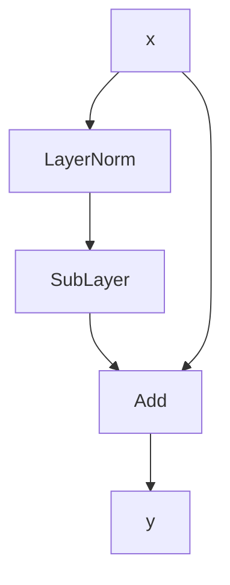
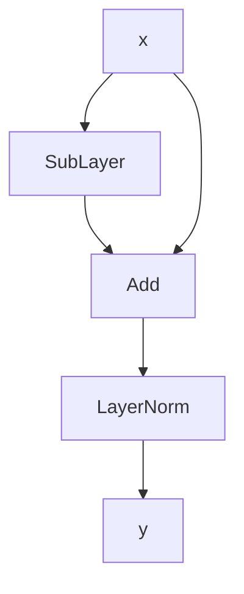

大语言模型并不是一种脱离 Transformer 而独立出现的新架构，而是在 Transformer 基础上经过长期演化与工程实践逐步形成的。从最初的 Encoder-Decoder，到如今主流的 Decoder-only，模型架构虽然不断变化，但其核心仍然围绕 Attention、FFN、位置编码、归一化等基本组件展开。本文将从原始 Transformer 出发，沿着架构演化的脉络逐步拆解现代 LLM 的核心组成，并结合参数量与计算量分析，理解这些组件为什么这样设计，以及它们最终如何共同构成今天的大语言模型

## Transformer

原始 Transformer 架构图如下


### Encoder

Encoder 负责理解序列，接收整个原始序列，输出一个融合了整个序列语义信息的上下文向量

Encoder 中的 Self-Attention 是双向的，每个位置上的 token 都可以融合整个序列的 token 信息，最终得到的表示向量融合了整个序列的信息

### Decoder

Decoder 负责生成序列，接收右移后的目标序列作为输入，输出下一个位置的 token 概率分布

Decoder 的任务是预测下一个 token，因此输入自然是之前的文本序列，即右移的目标序列。例如，`Inputs=(I, love, you)`，`Outputs=(我, 爱, 你)`，将 Outputs 右移，得到 `(<bos>, 我, 爱)`，将该序列作为 Decoder 的输入，预测目标为 `(<bos>, 我, 爱, 你)`

Decoder 中包含两个 Attention 模块，分别是 Masked Self-Attention 和 Cross-Attention

**Masked Self-Attention**

为了使得模型学习到下一个 token 的预测能力，在 Attention 计算中需要使得第 i 个位置的 token 只能融合前面的 token 信息，因此在 Attention 计算中，在注意力分数矩阵上加上一个上三角的负无穷掩码，使得 Softmax 在第 i 个位置之后的结果为 0

例如，输入序列为 `(<bos>, I, love)`，则掩码为

$$
mask=
\begin{bmatrix}
0 & -\infty & -\infty \\
0 & 0 & -\infty \\
0 & 0 & 0
\end{bmatrix}
$$

加上掩码后，`<bos>` 只能看到自己的 token 信息，`I` 只能看到 `(<bos>, I)` 的 token 信息，`love` 只能看到 `(<bos>, I, love)` 的 token 信息

**Cross-Attention**

Cross-Attention 在 Transformer 中用于连接 Encoder 和 Decoder，Encoder 输出的上下文表示向量用于生成 Attention 的 K 矩阵和 V 矩阵，Decoder 中 Masked Self-Attention 输出的掩码上下文表示向量用于生成 Attention 的 Q 矩阵

从定性的角度上理解，掩码上下文表示向量生成 Q 矩阵的过程可以看作在表示 " 生成下一个 token 需要查询哪些信息 " 这一问题，之后用 Encoder 上下文表示向量生成 K 和 V，则可以看作生成原文索引和原文信息。总的来说，Cross-Attention 可以使 Decoder 在生成过程中能够参考 Encoder 理解的原文信息

### 三条架构路线

由 Transformer 演化出三条架构路线

- Encoder-only：专注于文本理解，可将输出的上下文向量用于下游任务，代表模型为 BERT
- Encoder-Decoder：可用于处理几乎所有的 NLP 任务，将任务范式统一到 "text-to-text"，代表模型为 T5
- Decoder-only：专注于文本生成，基于预测下一个 token 的目标实现自回归的生成文本序列，代表模型为 GPT

最终，Decoder-only 架构成为了主流 LLM 的标准架构

**Decoder-only 架构**

目前的大模型都是由 Transformer 架构演变而来，主流上采用的是 Transformer 中的 Decoder 部分（Decoder-only），架构如下所示


该架构中主要包含以下组件

- Token Embedding：词嵌入，将 token 转换为向量
- Decoder block：LLM 中的核心组件，包含 Attention 计算和 FFN 计算，每个 Decoder block 的输入维度和输出维度是相同的，确保多个 block 可以任意堆叠
- Final LayNorm：最终归一化，稳定 Decoder block 的输出
- LM Head：线性层，将 Decoder block 的输出维度映射到词表维度，表示词表的 logits 向量
- Softmax + 采样：计算词表的概率分布，其中每个值表示下一个位置输出该 token 的概率，再根据采样策略选出下一个输出的 token

**为什么不需要 Cross-Attention**

值得注意的是，Decoder-only 架构中去除了 Cross-Attention，但依然具有参考原文的能力，这得益于 Decoder-only 的自回归生成范式

在 Transformer 中，输入序列和输出序列是两个独立的序列，输出序列从 `<bos>` 开始生成，原文信息存在于输入序列中，因此需要 Encoder 和 Cross-Attention 来理解原文并融合到 Decoder 生成过程中

而在 Decoder-only 的自回归生成范式中，输入序列和输出序列位于同一个生成序列中，原文信息自然存在于预测位置之前的序列中，可以通过 Masked Self-Attention 来理解前文信息，因此就不需要 Cross-Attention 来融合原文信息

**数据形状变化**

输入一个句子 `什么是注意力机制`

| 输入形状                    | 输出形状                    | 说明                                                                            |
| ----------------------- | ----------------------- | ----------------------------------------------------------------------------- |
| `什么是注意力机制`              | `(seq_len,)`            | Tokenizer 分词，转换为词表中的 Token ID                                                   |
| `(seq_len,)`            | `(seq_len, d_model)`    | 词嵌入，将 Token ID 转换为 Token Embedding，参数形状 `(vocab_size, d_model)`                   |
| `(seq_len, d_model)`    | `(seq_len, d_model)`    | L 层 Decoder block 计算，每层输入输出维度相同                                                  |
| `(seq_len, d_model)`    | `(seq_len, d_model)`    | 最终归一化，维度不变                                                                    |
| `(seq_len, d_model)`    | `(seq_len, vocab_size)` | 线性层，将输出映射到词表大小维度，参数形状 `(d_model, vocab_size)`                                  |
| `(seq_len, vocab_size)` | `(vocab_size,)`         | 输入中每个位置上的 `(vocab_size,)` 向量表示该位置的下一个位置在整个词表上的 token 预测分数，取最后一个位置的预测分数来预测下一个 token |
| `(vocab_size,)`         | `(vocab_size,)`         | Softmax，计算下一个位置的 token 概率分布                                                     |

## Self-Attention

### Attention

在 Transformer 中，使用了 Scaled Dot-Product Attention

$$
\mathrm{Attention}(Q,K,V)=\mathrm{Softmax}\left( \frac{QK^T}{\sqrt{ d }} \right)V
$$

其中，Q 称为查询向量，K 称为键向量，V 称为值向量，从直觉上理解，Q 表示“需要什么信息”，K 表示“信息的索引”，V 表示“信息的内容”，使用 Q 和 K 计算出一个注意力权重，再用注意力权重对 V 做加权求和

Self-Attention 中，X 通过三个不同的线性层来生成 Q、K、V 矩阵，X 的形状为 $(N,d_{m})$，N 为序列长度，$d_{m}$ 为嵌入向量维度

$$
\begin{aligned}
Q&=XW_{Q}\qquad (N,d_{m})\times(d_{m},d_{m})=(N,d_{m}) \\
K&=XW_{K}\qquad (N,d_{m})\times(d_{m},d_{m})=(N,d_{m}) \\
V&=XW_{V}\qquad (N,d_{m})\times(d_{m},d_{m})=(N,d_{m})
\end{aligned}
$$

Scaled Dot-Product Attention 公式可以拆分为以下公式

$$
\begin{align}
S&=QK^T\qquad &(N,d_{m})\times(d_{m},N)=(N,N)\tag{1} \\
S_{scaled}&=\frac{S}{\sqrt{ d }}\tag{2} \\
A&=\mathrm{Softmax}(S_{scaled})\tag{3} \\
\mathrm{Attention}&=AV\qquad &(N,N)\times(N,d_{m})=(N,d_{m})\tag{4}
\end{align}
$$

(1) 式计算原始的注意力分数，得到的结果是一个 $(N,N)$ 的矩阵，这导致了 $O(N^2)$ 的存储开销

(2) 式对原始注意力分数做缩放，保证注意力分数的方差与 Q、K 相同

(3) 式将缩放后的注意力分数转换为概率分布，作为注意力权重

(4) 式将注意力权重与 V 矩阵相乘，本质上就是按不同的注意力权重融合 V 向量的信息

### 缩放

$QK^T$ 矩阵乘法可以写成向量点积的形式，Q、K 矩阵形状为 $(N,d)$，定义如下

$$
Q=\left[
\begin{aligned}
q_{1} \\
q_{2} \\
\vdots \\
q_{N}
\end{aligned}
\right]\in\mathbb{R}^{N\times d}\qquad
K=\left[
\begin{aligned}
k_{1} \\
k_{2} \\
\vdots \\
k_{N}
\end{aligned}
\right]\in\mathbb{R}^{N\times d}
$$

则

$$
QK^T=\left[
\begin{aligned}
q_{1} \\
q_{2} \\
\vdots \\
q_{N}
\end{aligned}
\right]
\left[k^T_{1},k^T_{2},\cdots,k^T_{N}\right]
=\begin{bmatrix}
q_{1}\cdot k^T_{1} & q_{1}\cdot k^T_{2} & \cdots & q_{1}\cdot k^T_{N} \\
q_{2}\cdot k^T_{1} & q_{2}\cdot k^T_{2} & \cdots & q_{2}\cdot k^T_{N} \\
\vdots & \vdots & \ddots & \vdots \\
q_{N}\cdot k^T_{1} & q_{N}\cdot k^T_{2} & \cdots & q_{N}\cdot k^T_{N}
\end{bmatrix}
$$

现考虑结果矩阵中的一个元素 $\mathbf{q}_{i}\cdot \mathbf{k}^T_{i}$，其中 $\mathbf{q}=(q_{1},q_{2},\dots,q_{d})$，$\mathbf{k}=(k_{1},k_{2},\dots,k_{d})$，则

$$
\mathbf{q}\cdot \mathbf{k}=\sum^d_{i=1}q_{i}\cdot k_{i}
$$

设 q 向量和 k 向量中的每个分量都是均值为 0，方差为 1 的独立随机变量，$E(q_{i})=E(k_{i})=0$，$Var(q_{i})=Var(k_{i})=1$，两个随机变量相乘的均值为

$$
E(q_{i}\cdot k_{i})=E(q_{i})E(k_{i})=0\times 0=0
$$

方差为

$$
\begin{aligned}
E(q^2_{i})&=Var(q_{i})+[E(q_{i})]^2=1 \\
E(k^2_{i})&=Var(k_{i})+[E(k_{i})]^2=1 \\
Var(q_{i}\cdot k_{i})&=E(q^2_{i}\cdot k^2_{i})-[E(q_{i}\cdot k_{i})]^2 \\
&=E(q^2_{i})E(k^2_{i}) \\
&=1
\end{aligned}
$$

则

$$
\begin{aligned}
E(\mathbf{q}\cdot \mathbf{k})&=E\left( \sum^d_{i=1}q_{i}\cdot k_{i} \right)=\sum^d_{i=1}E(q_{i}\cdot k_{i})=0 \\
Var(\mathbf{q}\cdot \mathbf{k})&=Var\left(\sum^d_{i=1}q_{i}\cdot k_{i}\right)=\sum^d_{i=1}Var(q_{i}\cdot k_{i})=d
\end{aligned}
$$

随着 d 的增长，$QK^T$ 的方差也会增长，导致原始注意力分数值逐渐分散。经过 Softmax 函数计算后，会使得越来越多的分数值偏向 1 或 0，梯度逐渐消失

将原始注意力分数进行缩放后，可以稳定方差，使得 Softmax 的输入维持在合理范围内

$$
Var\left( \frac{\mathbf{q}\cdot \mathbf{k}}{\sqrt{ d }} \right)=\frac{Var(\mathbf{q}\cdot \mathbf{k})}{d}=1
$$

### 掩码

在 Attention 计算中，掩码应用在注意力分数上，定义如下

$$
\mathrm{Attention}(Q,K,V)=\mathrm{Softmax}\left( \frac{QK^T}{\sqrt{ d }}+M \right)V,\quad M\in \mathbb{R}^{N\times N}
$$

其中，M 为掩码矩阵

**Causal Mask**

Causal Mask（因果掩码）用于 Masked Self-Attention，可以使得 Attention 计算中每个 token 只能看到自身和它之前的 token，Causal Mask 定义如下

$$
M_{ij}=\begin{cases}
0, & j\leq i \\
-\infty, & j>i
\end{cases}
$$

若 $token_{j}$ 在 $token_{i}$ 之前，保持注意力分数，若 $token_{j}$ 在 $token_{i}$ 之后，令注意力分数加上一个极小的负值，再经过 Softmax 计算后，结果为 0

### Softmax

Softmax 公式

$$
Softmax(x_{i})=\frac{e^{ x_{i} }}{\sum^N_{j=1}e^{ x_{j} }}
$$

Softmax 需要计算的是 q 向量对所有 k 向量的注意力权重，因此应该对 $QK^T$ 的结果按行应用 Softmax 函数，而不是按列

标准 Softmax 函数中包含指数函数，指数函数增长非常快，当 x 值比较大时，指数函数计算值可能会直接导致溢出

指数函数值域是 $(0,+\infty)$，可以通过减最大值的技巧使得结果稳定在 $(0,1]$，Softmax 函数变为

$$
Softmax(x_{i})=\frac{e^{ x_{i}-\max(x) }}{\sum^N_{j=1}e^{ x_{j}-\max(x) }}
$$

**Online Softmax**

Online Softmax 可以将 Softmax 的计算过程变为一个在线更新的过程，得以支持分块并行计算 Attention，该算法已成为主流 LLM 中的标配

算法中维护两个变量，分别是最大值和指数和，定义如下

$$
\begin{aligned}
m_{i}&=\max_{1\leq j\leq i}(x_{j}) \\
d_{i}&=\sum^i_{j=1}e^{ x_{j}-m_{i} }
\end{aligned}
$$

在一次遍历中，同时更新最大值和指数和，再遍历一次，就可以计算整个序列的 Softmax 结果

对于 $\mathbf{x}=(x_{1},x_{2},\dots,x_{N})$，初始时

$$
\begin{aligned}
m_{1}&=x_{1} \\
d_{1}&=e^{ x_{1}-m_{1} }=1
\end{aligned}
$$

当遍历到 $x_{i}$ 时，若 $x_{i}\leq m_{i-1}$，则

$$
\begin{aligned}
m_{i}&=\max(m_{i-1},x_{i})=m_{i-1} \\
d_{i}&=\sum^i_{j=1}e^{ x_{j}-m_{i} } \\
&=\sum^{i-1}_{j=1}e^{ x_{j}-m_{i} }+e^{ x_{i}-m_{i} } \\
&=\sum^{i-1}_{j=1}e^{ x_{j}-m_{i-1} }+e^{ x_{i}-m_{i} } \\
&=d_{i-1}+e^{ x_{i}-m_{i} }
\end{aligned}
$$

若 $x_{i}> m_{i-1}$，则

$$
\begin{aligned}
m_{i}&=\max(m_{i-1},x_{i})=x_{i} \\
d_{i}&=\sum^{i}_{j=1}e^{ x_{j}-m_{i} } \\
&=\sum^{i-1}_{j=1}e^{ x_{j}-m_{i} }+e^{ x_{i}-m_{i} } \\
&=\sum^{i-1}_{j=1}e^{ x_{j}-m_{i-1}+m_{i-1}-m_{i} }+e^{ x_{i}-m_{i} } \\
&=\left(\sum^{i-1}_{j=1}e^{ x_{j}-m_{i-1} }\right)e^{ m_{i-1}-m_{i} }+e^{ x_{i}-m_{i} } \\
&=d_{i-1}e^{ m_{i-1}-m_{i} }+e^{ x_{i}-m_{i} }
\end{aligned}
$$

因此，最大值和指数和的递推公式如下

$$
\begin{aligned}
m_{i}&=\max(m_{i-1},x_{i}) \\
d_{i}&=d_{i-1}e^{ m_{i-1}-m_{i} }+e^{ x_{i}-m_{i} }
\end{aligned}
$$

### Multi-Head Attention

使用多头自注意力，可以使得模型学习到不同的关注模式，多头自注意力定义如下

$$
\begin{aligned}
\mathrm{MHA}(X)&=\mathrm{Concat}(head_{1},head_{2},\dots,head_{h})W_{O} \\
head_{i}&=\mathrm{Attention}(XW^i_{Q},XW^i_{K},XW^i_{V})
\end{aligned}
$$

其中，$W^i_{Q}$、$W^i_{K}$、$W^i_{V}$ 的形状为 $(d_{m},d_{h})$，$d_{h}$ 满足 $d_{h}\cdot h=d_{m}$

在实践中，利用分块矩阵的性质，令 X 与一个大的 Q/K/V 矩阵相乘后，再 reshape 成 $(N,h,d_{h})$，然后继续转置成 $(h,N,d_{h})$，将最后两个维度用于 Attention 计算

大 Q/K/V 矩阵的形状为 $(d_{m},d_{m})$，整个过程表示为

$$
(N,d_{m})\times(d_{m},d_{m})=(N,d_{m})\xrightarrow{reshape}(N,h,d_{h})\xrightarrow{transpose}(h,N,d_{h})
$$

这样可以一次性计算所有头的 Q、K、V，这与原公式是等价的，其中利用了矩阵乘法的分块性质，证明如下

设

$$
X\in \mathbb{R}^{N\times d_{m}}\qquad W\in \mathbb{R}^{d_{m}\times d_{m}}
$$

将 W 按列均分为 h 个子矩阵，有

$$
W=[W_{1}|W_{2}|\dots|W_{h}]
$$

其中 $W_{i}\in \mathbb{R}^{d_{m}\times d_{h}},h\cdot d_{h}=d_{m}$，根据矩阵乘法的分块性质，有

$$
XW=X[W_{1}|W_{2}|\dots|W_{h}]=[XW_{1}|XW_{2}|\dots|XW_{h}]
$$

经过 reshape 后，每个头中的 Q、K、V 与原公式相同

**其他多头注意力**

基于 MHA，发展出了其他的多头注意力变体

| 多头注意力 | 核心机制                                                                  | 性能表现               |
| ----- | --------------------------------------------------------------------- | ------------------ |
| MHA   | 包含 h 个 Q 头、h 个 K 头、h 个 V 头，每个头的 Q/K/V 权重互不共享                          | 模型质量最好，但参数量太大      |
| MQA   | 包含 h 个 Q 头，1 个 K 头、1 个 V 头，所有 Q 头共享一组 K、V 权重                           | 模型质量较差，但参数量小，推理速度快 |
| GQA   | 包含 h 个 Q 头，$h_{kv}$ 个 K 头、$h_{kv}$ 个 V 头，每 $h/h_{kv}$ 个 Q 头共享一组 K、V 权重 | 平衡了模型质量与参数量，成为主流标配 |
| MLA   | 将 K/V 矩阵压缩为一个低维矩阵，在推理时按需解压出 K/V 矩阵                                    | 在大批量推理和吞吐性能上更优     |

### 参数量分析

**MHA 参数量**

MHA 参数如下表所示

| 参数      | 形状              | 参数量       |
| ------- | --------------- | --------- |
| $W_{Q}$ | $(d_{m},d_{m})$ | $d^2_{m}$ |
| $W_{K}$ | $(d_{m},d_{m})$ | $d^2_{m}$ |
| $W_{V}$ | $(d_{m},d_{m})$ | $d^2_{m}$ |
| $W_{O}$ | $(d_{m},d_{m})$ | $d^2_{m}$ |

参数量共有

$$
P_{MHA}=W_{Q}+W_{K}+W_{V}+W_{O}=4d^2_{m}
$$

**GQA 参数量**

设有 h 个 Q 头，注意力头维度为 $d_{h}$，有 g 个 K、V 头

每个 Q 头的权重形状为 $(d_{m},d_{h})$，共有 h 个 Q 头，则 Q 权重的参数量为

$$
P_{Q}=d_{m}\cdot d_{h}\cdot h=d^2_{m}
$$

每个 K/V 头的权重形状为 $(d_{m},d_{h})$，共有 g 个 K/V 头，则 K/V 权重的参数量为

$$
P_{K}=P_{V}=d_{m}\cdot d_{h}\cdot g
$$

输出投影权重 $W_{O}$ 的形状为 $(hd_{h},d_{m})$，参数量为

$$
P_{O}=h\cdot d_{h}\cdot d_{m}=d^2_{m}
$$

综上，GQA 总参数量为

$$
P_{GQA}=2d^2_{m}+2d_{m}d_{h}g
$$

### 计算量分析

在分析模型计算量时，通常以 FLOPs（浮点运算数）作为衡量单位，而在 LLM 中，计算量主要来自矩阵乘法，因此通常以矩阵乘法的 FLOPs 来衡量 LLM 计算量

> FLOPs 表示浮点运算数，而 FLOPS（全大写）表示每秒浮点运算次数

矩阵乘法的 FLOPs 分析如下

设矩阵 $A\in \mathbb{R}^{m\times k},B\in \mathbb{R}^{k\times n}$，有

$$
\begin{aligned}
(AB)_{ij}&=\mathbf{a}_{i}^T \mathbf{b}_{j} \\
\mathbf{a}_{i}^T \mathbf{b}_{j}&=a_{i1}b_{1j}+a_{i2}b_{2j}+\dots+a_{ik}b_{kj}
\end{aligned}
$$

一次矩阵乘法中包含 $m\times n$ 次向量点积，一次向量点积包含 k 次乘法和 k-1 次加法，则总 FLOPs 为

$$
\begin{aligned}
\mathrm{FLOPs}&=mn(k+k-1) \\
&=mn(2k-1) \\
&=2kmn-mn
\end{aligned}
$$

该计算量公式在用于估算模型计算量时，通常近似为 $2kmn$，因此矩阵乘法的 FLOPs 为 $2kmn$

> 为什么可以忽略 $mn$ 项：从点积公式上看，在计算出第一项 $a_{i1}b_{1j}$ 后，才开始累加 $a_{i\cdot}b_{\cdot j}$ 项，而在通用矩阵乘（GEMM）实现中，实际从 0 开始累加 $a_{i\cdot}b_{\cdot j}$ 项，即 $\mathbf{a}_{i}\cdot \mathbf{b}_{j}=0+a_{i1}b_{1j}+a_{i2}b_{2j}+\dots+a_{ik}b_{kj}$，进行了 k 次加法和 k 次乘法，因此，矩阵乘法的 FLOPs 为 $2kmn$ 实际上更符合实践

**MHA**

设序列长度为 N，embedding 维度为 $d_{m}$，注意力头个数为 h，注意力头维度为 $d_{h}$

在标准 MHA 中包含以下矩阵乘法

| 运算           | 形状                                         | FLOPs                     |
| ------------ | ------------------------------------------ | ------------------------- |
| $XW_{Q}$     | $(N,d_{m})\times(d_{m},d_{m})=(N,d_{m})$   | $2Nd_{m}^2$               |
| $XW_{K}$     | $(N,d_{m})\times(d_{m},d_{h}h)=(N,d_{h}h)$ | $2Nd_{m}d_{h}h=2Nd_{m}^2$ |
| $XW_{V}$     | $(N,d_{m})\times(d_{m},d_{h}h)=(N,d_{h}h)$ | $2Nd_{m}d_{h}h=2Nd_{m}^2$ |
| $h$ 次 $QK^T$ | $(N,d_{h})\times(d_{h},N)=(N,N)$           | $2hN^2d_{h}=2N^2d_{m}$    |
| $h$ 次 $AV$   | $(N,N)\times(N,d_{h})=(N,d_{h})$           | $2hN^2d_{h}=2N^2d_{m}$    |
| $OW_{O}$     | $(N,d_{m})\times(d_{m},d_{m})=(N,d_{m})$   | $2Nd_{m}^2$               |

总 FLOPs 为 $8Nd_{m}^2+4N^2d_{m}$，具有平方级时间复杂度 $O(N^2)$

当 N 较小时，主导项是 $8Nd_{m}^2$，计算瓶颈在 Q/K/V 的投影计算，当 N 较大时，主导项是 $4N^2d_{m}$

**GQA**

设 K/V 注意力头个数为 $h_{kv}$，计算量统计如下

| 运算           | 形状                                                   | FLOPs                  |
| ------------ | ---------------------------------------------------- | ---------------------- |
| $XW_{Q}$     | $(N,d_{m})\times(d_{m},d_{m})=(N,d_{m})$             | $2Nd_{m}^2$            |
| $XW_{K}$     | $(N,d_{m})\times(d_{m},d_{h}h_{kv})=(N,d_{h}h_{kv})$ | $2Nd_{m}d_{h}h_{kv}$   |
| $XW_{V}$     | $(N,d_{m})\times(d_{m},d_{h}h_{kv})=(N,d_{h}h_{kv})$ | $2Nd_{m}d_{h}h_{kv}$   |
| $h$ 次 $QK^T$ | $(N,d_{h})\times(d_{h},N)=(N,N)$                     | $2hN^2d_{h}=2N^2d_{m}$ |
| $h$ 次 $AV$   | $(N,N)\times(N,d_{h})=(N,d_{h})$                     | $2hN^2d_{h}=2N^2d_{m}$ |
| $OW_{O}$     | $(N,d_{m})\times(d_{m},d_{m})=(N,d_{m})$             | $2Nd_{m}^2$            |

总计算量为 $4Nd_{m}^2+4N^2d_{m}+4Nd_{m}d_{h}h_{kv}=4Nd_{m}^2\left( 1+\frac{h_{kv}}{h} \right)+4N^2d_{m}$

从 $1+\frac{h_{kv}}{h}$ 项可以看到，当 $h_{kv}=h$ 时，实现的 Attention 是 MHA，当 $h_{kv}=1$ 时，实现的 Attention 是 MQA

## FFN

Transformer 中的标准 FFN 表示为

$$
FFN(X)=σ(XW_{1}+b_{1})W_{2}+b_{2}
$$

其中，$X\in \mathbb{R}^{N\times d_{m}}$，$W_{1}\in \mathbb{R}^{d_{m}\times d_{ff}}$，$W_{2}\in \mathbb{R}^{d_{ff},d_{m}}$，$\sigma(\cdot)$ 是非线性激活函数，在实践中，一般取 $d_{ff}=4d_{m}$

参数量为 $2d_{m}d_{ff}=8d^2_{m}$（通常忽略偏置项）

> 为什么先升维再降维：这源于一个统计学习中的基本认识，样本在高维空间中的线性可分性更好。先升维后再配合激活函数，可以更好的选择或抑制某些信号，最后降维实现信息蒸馏

### 激活函数

**ReLU**

在 Transformer 中使用的是 ReLU 激活函数

$$
\mathrm{ReLU}(x)=\max(0,x)
$$


该激活函数计算简单，不存在梯度衰减问题，但存在神经元死亡的问题，即一旦某个神经元输入值落在 ReLU 负半轴，ReLU 输出为 0，该神经元在反向传播时就无法更新权重，对模型计算几乎没有贡献

**GELU**

GELU 引入了概率化门控的做法，让 x 以一定概率被保留或抑制，实现“软门控”

$$
\mathrm{GELU}=x\cdot \Phi(x)
$$

其中，$\Phi(x)$ 是标准正态分布的累积分布函数，函数处处可微


**Swish**

Swish 是另一种“软门控”激活函数，函数处处可微

$$
\mathrm{Swish}(x)=x\cdot \sigma(\beta x)
$$

其中，$\sigma(x)$ 是 sigmoid 函数，$\beta$ 是一个可学习或固定的参数，当 $\beta=1$ 时，简写为 $\mathrm{SiLU}(x)=x\cdot \sigma(x)$


### GLU

标准 FFN 中，只有激活函数能够控制特征通过的规则，方式比较简单，而 GLU（门控线性单元）可以使模型自己学习到哪些特征要保留多少或抑制多少，激活表达能力更强，因此，后续 LLM 的 FFN 模块主要采用 GLU 系列模块

原始 GLU 的定义如下

$$
\mathrm{GLU}(x)=(xW_{up})\otimes\sigma(xW_{gate})
$$

其中，$\otimes$ 为逐元素相乘，$\sigma(x)$ 为 sigmoid 函数，$xW_{up}$ 称为值分支，表示候选特征，$xW_{gate}$ 表示门控分支，决定候选特征通过多少。值分支和门控分支都由 x 线性变换而来，具有根据输入动态加权的能力，从而实现更强的激活表达

基于原始 GLU，修改其中的激活函数，可以得到 GLU 函数族

$$
\begin{aligned}
\mathrm{GLU}(x)&=(xW_{up})\otimes \sigma(xW_{gate}) \\
\mathrm{ReGLU}(x)&=(xW_{up})\otimes \mathrm{ReLU}(xW_{gate}) \\
\mathrm{GEGLU}(x)&=(xW_{up})\otimes \mathrm{GELU}(xW_{gate}) \\
\mathrm{SwiGLU}(x)&=(xW_{up})\otimes \mathrm{Swish}(xW_{gate})
\end{aligned}
$$

经过实践验证，SwiGLU 相较于其他 GLU 类函数具有最佳性能，因此主流 LLM 基本上采用了 SwiGLU

### SwiGLU

采用 SwiGLU 实现的 FFN 模块定义如下

$$
\mathrm{FFM}_{SwiGLU}(X)=\left[(XW_{up})\otimes \mathrm{Swish(XW_{gate})}\right]W_{down}
$$

其中，$W_{up}\in \mathbb{R}^{d_{m}\times d_{ff}},W_{gate}\in \mathbb{R}^{d_{m}\times d_{ff}},W_{down}\in \mathbb{R}^{d_{ff}\times d_{m}}$，参数量为 $3d_{m}d_{ff}$，在 SwiGLU 中，取 $d_{ff}=\frac{8}{3}d_{m}$，则参数量为 $3d_{m}d_{ff}=8d^2_{m}$，与标准 FFN 参数量保持一致

> 在实践中，$d_{ff}$ 会被取整到 $\frac{8}{3}d_{m}$ 附近的特定数值的倍数，如 $\frac{8}{3}d_{m}$ 附近 128 或 256 的倍数，使得维度可以被 GPU 高效处理

### MoE

FFN 模块是 LLM 中参数量最大的部分，参数量是 Attention 模块的 2 倍，因此，减小该模块的计算量是非常必要的

MoE 的基本思想是将一个大的 FFN 拆分为多少小的 FFN，称为专家（Expert），在前向计算时，只激活其中少数几个专家用于计算，其他专家保持休眠，从而达到大参数量小计算量的效果，这种方式可以让模型具有足够的容量存储知识，同时计算推理的成本可控

**路由机制**

MoE 中使用一个路由模块来决定每个 token 被发送到哪些专家，最常见的是 Top-K 路由，即在 n_experts 维的概率分布中，选择概率最大的 K 个专家

$$
\begin{aligned}
g(x)&=\mathrm{Softmax}(xW_{r}),\quad W_{r}\in \mathbb{R}^{d_{m}\times N_{e}} \\
\mathrm{TopK}(g(x))&\to \text{Select the top-K experts.}
\end{aligned}
$$

其中，$N_{e}$ 是专家的数量，最终输出为

$$
\mathrm{MoE}(X)=\sum_{i\in\mathrm{TopK}}g_{i}(X)\cdot \mathrm{Expert}_{i}(X)
$$

其中，$g_{i}(X)$ 在 TopK 范围内再次进行归一化作为权重，专家输出加权求和作为 MoE 输出

**负载均衡**

MoE 模块训练最严重的问题是负载不均衡，即路由可能将大部分的输入发送到少数的几个专家，导致其他专家得不到训练，有以下解决思路

1. 加入负载均衡损失：在损失函数中添加一个负载均衡损失，当所有专家的负载均衡时，损失最小
2. 设置容量因子：为每个专家设置一个容量因子，即可接收 token 的最大数量，当专家接收的 token 数量超过容量时，将多余的 token 分配到其他专家或直接直通
3. Expert Choice 路由：TopK 路由是让 token 选择 Top-K 个专家，而 Expert Choice 路由直接让专家选择 Top-K 个 token，这可以从根本上解决负载不均衡的问题

## 位置编码

在 Transformer 中，位置编码用于在序列中添加位置信息，使得 Attention 可以提取到位置相关的 token 信息

**为什么需要位置编码**

在文本任务中，天然需要处理词的位置关系，而 Attention 计算无法感知位置信息

设正交置换矩阵 $P\in \mathbb{R}^{N\times N}$，$PP^T=I$，对输入的 token 位置进行打乱（行置换），有 $X'=PX$，则 Attention 计算变为

$$
\begin{aligned}
Q'&=X'W_{Q}=PXW_{Q}=PQ \\
K'&=X'W_{K}=PXW_{K}=PK \\
V'&=X'W_{V}=PXW_{V}=PV \\
\mathrm{Attention}(Q',K',V')&=\mathrm{Softmax}\left( \frac{Q'{K'}^T}{\sqrt{ d }}\right)V' \\
&=\mathrm{Softmax}\left( \frac{PQK^TP^T}{\sqrt{ d }} \right)PV \\
&=P\mathrm{Softmax}\left( \frac{QK^T}{\sqrt{ d }} \right)P^TPV \\
&=P\mathrm{Softmax}\left( \frac{QK^T}{\sqrt{ d }} \right)V \\
&=P\mathrm{Attention}(Q,K,V)
\end{aligned}
$$

这表示了 Attention 计算的排列等变性，即输入打乱后，输出只是做了相同的打乱，Attention 提取的 token 信息与位置无关，因此需要在序列中加入位置信息，使得模型能够正确理解文本

**两种位置编码方案**

- 绝对位置编码：为序列中的 token 分配一个固定的位置编码，通常直接将编码与 embedding 相加后再输入 Attention
- 相对位置编码：在 Attention 计算时注入两个 token 的相对位置信息，在每次 Attention 计算时都计算一次位置编码

目前主流 LLM 都采用了相对位置编码，这是由于绝对位置编码具有以下局限性

1. 绝对位置编码以加法的形式融合到嵌入向量中，这在深层模型中会被稀释，导致位置信息逐渐丢失
2. 在训练过程中，绝对位置编码只能在一个有限的长度中分配编码，在超出训练长度的位置上泛化效果差，难以外推到任意长度

### Sinusoidal 编码

在 Transformer 中实现了 Sinusoidal 编码，这是一种绝对位置编码，定义如下

$$
\begin{aligned}
PE(pos,2i)&=\sin\left( \frac{pos}{10000^{2i/d}} \right) \\
PE(pos,2i+1)&=\cos\left( \frac{pos}{10000^{2i/d}} \right)
\end{aligned}
$$

### ALiBi 编码

ALiBi 编码是相对位置编码，它直接在注意力分数加上一个与距离成正比的负偏置项

$$
\begin{aligned}
\mathrm{Attention}(Q,K,V)&=\mathrm{Softmax}\left( \frac{QK^T}{\sqrt{ d }}+mB \right)V \\
B_{ij}&=-|i-j|,\quad B\in \mathbb{R}^{N\times N},m\in R
\end{aligned}
$$

偏置矩阵 B 中的值表示 $token_{i}$ 到 $token_{j}$ 的距离的负值，这意味着，若 $token_{i}$ 到 $token_{j}$ 的距离越远，$token_{i}$ 对 $token_{j}$ 注意力分数被减去的值越大，实现随距离的线性衰减

### RoPE 编码

RoPE 编码（旋转位置编码）是目前 LLM 的主流位置编码方法，是一种相对位置编码，它通过变换 Q、K 向量来注入位置信息

RoPE 编码的基本思想是用 token 的位置来决定向量的旋转角度，使得两个旋转后的向量点积与 token 的位置之差有关

设 $\mathbf{\alpha}=[x,y]^T$，向量旋转定义如下

$$
\begin{aligned}
\mathbf{\alpha}'&=R(\theta)\mathbf{\alpha}=\begin{bmatrix}
\cos \theta & -\sin \theta \\
\sin \theta & \cos \theta
\end{bmatrix}
\begin{bmatrix}
x \\
y
\end{bmatrix} \\
x'&=x\cos \theta-y\sin \theta \\
y'&=x\sin \theta+y\cos \theta
\end{aligned}
$$

在 $d_{m}=2$ 时，设 $\mathbf{q}=[q_{1},q_{2}]^T,\mathbf{k}=[k_{1},k_{2}]^T$，q 向量和 k 向量代表的 token 分别位于 m 和 n，旋转后得

$$
\begin{aligned}
\mathbf{q}'=R(m\theta)\mathbf{q}=\begin{bmatrix}
\cos (m\theta) & -\sin (m\theta) \\
\sin (m\theta) & \cos (m\theta)
\end{bmatrix}
\begin{bmatrix}
q_{1} \\
q_{2}
\end{bmatrix} \\
\mathbf{k}'=R(n\theta)\mathbf{k}=\begin{bmatrix}
\cos (n\theta) & -\sin (n\theta) \\
\sin (n\theta) & \cos (n\theta)
\end{bmatrix}
\begin{bmatrix}
k_{1} \\
k_{2}
\end{bmatrix}
\end{aligned}
$$

由旋转矩阵的性质 $R(\theta)^T=R(-\theta)$，有

$$
\begin{aligned}
R(m\theta)^TR(n\theta)&=R(-m\theta)R(n\theta) \\
&=\begin{bmatrix}
\cos (m\theta) & \sin(m\theta) \\
-\sin(m\theta) & \cos(m\theta)
\end{bmatrix}
\begin{bmatrix}
\cos(n\theta) & -\sin(n\theta) \\
\sin(n\theta) & \cos(n\theta)
\end{bmatrix} \\
&=\begin{bmatrix}
\cos(m\theta)\cos(n\theta)+\sin(m\theta)\sin(n\theta) & -\cos(m\theta)\sin(n\theta)+\sin(m\theta)\cos(n\theta) \\
-\sin(m\theta)\cos(n\theta)+\cos(m\theta)\sin(n\theta) & \sin(m\theta)\sin(n\theta)+\cos(m\theta)\cos(n\theta)
\end{bmatrix} \\
&=\begin{bmatrix}
\cos(n\theta-m\theta) & -\sin(n\theta-m\theta) \\
\sin(n\theta-m\theta) & \cos(n\theta-m\theta)
\end{bmatrix} \\
&=R(n\theta-m\theta) \\
&=R((n-m)\theta)
\end{aligned}
$$

旋转后向量点积为

$$
\mathbf{q}^{\prime T}\mathbf{k}'=\mathbf{q}^TR(m\theta)^TR(n\theta)\mathbf{k}=\mathbf{q}^TR(-m\theta)R(n\theta)\mathbf{k}=\mathbf{q}^TR((n-m)\theta)\mathbf{k}
$$

向量点积结果依赖两个 token 的相对位置之差 $(n-m)$

RoPE 编码可以自然地推广到高维向量，当 $d_{m}> 2$ 时，将 $d_{m}$ 维向量拆分为 $d_{m}/2$ 个 2 维向量，每个 2 维向量独立做旋转，所有旋转矩阵组成一个分块对角矩阵，定义符号 $R_{m,i}:=R(m\theta_{i})$，有

$$
R_{m}=\begin{bmatrix}
R_{m,0} &  &  &  \\
 & R_{m,1} &  &  \\
 &  & \ddots &   \\
 &  &  & R_{m,d/2-1}
\end{bmatrix},\quad
\theta_{i}=\frac{1}{10000^{2i/d}}
$$

对 q 向量和 k 向量做旋转，有

$$
\begin{aligned}
\mathbf{q}'&=R_{m}\mathbf{q} 
=\begin{bmatrix}
R_{m,0} &  &  & \\
 & R_{m,1} &  & \\
 &  & \ddots & \\
 &  &  & R_{m,d/2-1}
\end{bmatrix}
\begin{bmatrix}
\mathbf{q}_{0} \\
\mathbf{q}_{1} \\
\vdots \\
\mathbf{q}_{d/2-1}
\end{bmatrix}
=\begin{bmatrix}
R_{m,0}\mathbf{q}_{0} \\
R_{m,1}\mathbf{q}_{1} \\
\vdots \\
R_{m,d/2-1}\mathbf{q}_{d/2-1}
\end{bmatrix} \\

\mathbf{k}'&=R_{n}\mathbf{k} 
=\begin{bmatrix}
R_{n,0} &  &  & \\
 & R_{n,1} &  & \\
 &  & \ddots & \\
 &  &  & R_{n,d/2-1}
\end{bmatrix}
\begin{bmatrix}
\mathbf{k}_{0} \\
\mathbf{k}_{1} \\
\vdots \\
\mathbf{k}_{d/2-1}
\end{bmatrix}
=\begin{bmatrix}
R_{n,0}\mathbf{k}_{0} \\
R_{n,1}\mathbf{k}_{1} \\
\vdots \\
R_{n,d/2-1}\mathbf{k}_{d/2-1}
\end{bmatrix}
\end{aligned}
$$

向量做点积，有

$$
\begin{aligned}
\mathbf{q}^{\prime T}\mathbf{k}'&=\begin{bmatrix}
\mathbf{q}^T_{0}R_{m,0}^T & \mathbf{q}^T_{1}R_{m,1}^T & \dots & \mathbf{q}^T_{d/2-1}R_{m,d/2-1}^T \\
\end{bmatrix}
\begin{bmatrix}
R_{n,0}\mathbf{k_{0}} \\
R_{n,1}\mathbf{k}_{1} \\
\vdots \\
R_{n,d/2-1}\mathbf{k}_{d/2-1}
\end{bmatrix} \\
&=\sum^{d/2-1}_{i=0}\mathbf{q}^T_{i}R^T_{m,i}R_{n,i}\mathbf{k}_{i} \\
&=\sum^{d/2-1}_{i=0}\mathbf{q}^T_{i}R_{n-m,i}\mathbf{k}_{i}
\end{aligned}
$$

其中，每一个 $\mathbf{q}^T_{i}R_{n-m,i}\mathbf{k}_{i}$ 就是每一个二维旋转子块的点积，旋转后的高维 qk 向量点积就是各个二维旋转子块点积的和

以上推导可以证明 RoPE 位置编码可以使得二维或高维的 qk 向量点积结果依赖于 token 的相对位置，在实践中，直接对向量做逐元素的乘法和加法更加高效

$$
\begin{aligned}
q_{2i}'&=q_{2i}\cos(m\theta_{i})-q_{2i+1}\sin(m\theta_{i}) \\
q_{2i+1}'&=q_{2i}\sin(m\theta_{i})+q_{2i+1}\cos(m\theta_{i})
\end{aligned}
$$

> 为什么只对 q 和 k 做旋转：RoPE 位置编码设计只在“信息检索”（qk 向量点积）的过程中加入对位置的感知，不需要对 token 蕴含的信息本身（v 向量）添加位置感知，这样的设计更加简洁有效

## 归一化方法

Transformer 中采用的是 LayerNorm（层归一化），具体来说，是沿特征维度对每个样本独立进行归一化

对每个 token 的特征向量 x，形状为 $(d_{m,})$，LayerNorm 计算如下

$$
\begin{aligned}
\mu&=\frac{1}{d_{m}}\sum^{d_{m}}_{i=1}x_{i} \\
\sigma^2&=\frac{1}{d_{m}}\sum^{d_{m}}_{i=1}(x_{i}-\mu)^2 \\ \\
x_{i}'&=\gamma_{i} \cdot \frac{x_{i}-\mu}{\sqrt{ \sigma^2+\epsilon }}+\beta_{i}
\end{aligned}
$$

其中，$\gamma$ 和 $\beta$ 是可学习参数，形状为 $(d_{m},)$

> BatchNorm：BatchNorm 是沿着 batch 维度，对每个特征进行归一化的归一化方法，但它并不适用于 NLP 领域，主要原因是 NLP 中样本序列的长度不一致。即使做了 padding，但 padding 位置的值是无意义的，进入均值/方差计算会引入噪声。其次，BatchNorm 沿着 batch 维度计算，不适用于自回归生成的范式

### RMSNorm

RMSNorm 提出 LayerNorm 的效果主要是重新缩放，而不是重新中心化，因此 RMSNorm 中去除了减掉均值这一步，RMSNorm 定义为

$$
\begin{aligned}
\mathrm{RMS}(x)=\sqrt{ \frac{1}{d}\sum^d_{i=1}x^2_{i} } \\
x_{i}'=\gamma_{i}\cdot \frac{x_{i}}{\mathrm{RMS}(x)}
\end{aligned}
$$

其中，$\gamma$ 是一个可学习参数，形状为 $(d_{m},)$，实验表明，RMSNorm 与 LayerNorm 效果相当，但 RMSNorm 相比 LayerNorm 减少了均值的计算，也就减少了一次数据扫描，提升了运算性能

### Pre-Norm 与 Post-Norm

Pre-Norm 与 Post-Norm 是两种 LayerNorm 放置的设计

**Pre-Norm**

将 LayerNorm 放在残差相加之前，表示为

$$
y=x+\mathrm{SubLayer}(\mathrm{LayerNorm}(x))
$$



**Post-Norm**

将 LayerNorm 放在残差相加之后，表示为

$$
y=\mathrm{LayerNorm}(x+\mathrm{SubLayer}(x))
$$



Pre-Norm 与 Post-Norm 的区别在于梯度的稳定性。Post-Norm 在残差相加后经过了 LayerNorm，残差项会被 LayerNorm 变换，而 Pre-Norm 在残差相加后没有其他模块，更多地保留了恒等映射，因此梯度更容易保持到深层网络，因此训练的稳定性更好，目前的主流 LLM 都采用了 Pre-Norm

## Decoder Block

Decoder Block 架构如下图所示


定义模型配置参数表

| 参数       | 含义             |
| -------- | -------------- |
| $d_{m}$  | embedding 特征维度 |
| $h$      | 注意力头数          |
| $h_{kv}$ | K/V 注意力头数      |
| $d_{h}$  | 注意力头特征维度       |
| $d_{ff}$ | FFN 隐藏层维度      |

Attention 模块使用 GQA，FFN 模块使用 SwiGLU，Norm 模块使用 RMSNorm，位置编码使用 RoPE 位置编码

### 参数量分析

| 模块      | 参数量                                              |
| ------- | ------------------------------------------------ |
| GQA     | $2d^2_{m}+2d_{m}d_{h}h_{kv}$                     |
| SwiGLU  | $3d_{m}d_{ff}$                                   |
| RMSNorm | $2d_{m}$                                         |
| RoPE    | $0$                                              |
| 总计      | $2d^2_{m}+2d_{m}d_{h}h_{kv}+3d_{m}d_{ff}+2d_{m}$ |

### 计算量分析

下面逐个模块分析计算量

**GQA + RoPE**

根据上文，GQA 计算量为 $4Nd_{m}^2\left( 1+\frac{h_{kv}}{h} \right)+4N^2d_{m}$

RoPE 运算是逐元素运算，每次 RoPE 运算包含一次加法和两次乘法。对 Q 向量做 RoPE 运算，计算量为 $3Nd_{h}h$，对 K 向量做 RoPE 运算，计算量为 $3Nd_{h}h_{kv}$，因此，RoPE 总计算量为 $3Nd_{h}h+3Nd_{h}h_{kv}=3Nd_{m}\left( 1+\frac{h_{kv}}{h} \right)$

综上，应用 RoPE 位置编码的 GQA 模块的总计算量为 $4Nd_{m}^2\left( 1+\frac{h_{kv}}{h} \right)+4N^2d_{m}+3Nd_{m}\left( 1+\frac{h_{kv}}{h} \right)$，渐进后忽略位置编码项，因此总计算量记为 $4Nd_{m}^2\left( 1+\frac{h_{kv}}{h} \right)+4N^2d_{m}$

**SwiGLU + RMSNorm**

SwiGLU 中包含三次矩阵乘法

| 运算          | 计算量             |
| ----------- | --------------- |
| $XW_{up}$   | $2Nd_{m}d_{ff}$ |
| $XW_{gate}$ | $2Nd_{m}d_{ff}$ |
| $HW_{down}$ | $2Nd_{m}d_{ff}$ |

矩阵乘法计算量为 $6Nd_{m}d_{ff}$

Swish 激活函数计算与逐元素乘法渐进为 $O(Nd_{ff})$，相比矩阵乘法可忽略，因此 SwiGLU 总计算量记为 $6Nd_{m}d_{ff}$

RMSNorm 运算是逐 token 运算，每个 token 的特征维度为 $d_{m}$，一个 token 的 RMSNorm 计算是对一维向量的若干次四则运算，因此可以渐进为 $O(d_{m})$，对整个序列的计算量为 $O(Nd_{m})$

综上，SwiGLU 与 RMSNorm 的总计算量为 $6Nd_{m}d_{ff}+O(Nd_{m})$，RMSNorm 计算量相比 SwiGLU 可忽略，因此，两个模块总计算量记为 $6Nd_{m}d_{ff}$

综上分析，整个 Decoder Block 的总计算量为 $4Nd_{m}^2\left( 1+\frac{h_{kv}}{h} \right)+4N^2d_{m}+6Nd_{m}d_{ff}$，可渐进为 $O(Nd_{m}^2)+O(N^2d_{m})+O(Nd_{m}d_{ff})$，分别对应 Q/K/V 矩阵计算、注意力矩阵计算、FFN 计算

## Decoder

下面分析完整 Decoder 架构中的其他组件

### Token Embedding

Token Embedding 的作用是将 token id 转换为 token embedding，其中维护一个可学习的查找矩阵 $W_{emb}\in \mathbb{R}^{V\times d_{m}}$，V 表示词表大小

计算时，输入一个 token id，直接取 $W_{emb}$ 中对应的行向量作为 embedding 向量，即

```python
token_embedding = W_emb[token_id, :]
```

因此，Token Embedding 模块的参数量为 $Vd_{m}$

### LM Head

LM Head 是一个简单的线性层，参数形状为 $(d_{m},V)$，将每个 token 的特征向量映射到 logits 向量，输出形状为 $(N,V)$

**如何理解 logits 向量**

在 LM Head 的输出中，每个行向量是一个 token 的 logits 向量，形状为 $(V,)$，它的值表示对词表中每个 token 的原始打分，下标对应 token id，例如

```
logits = [-0.2, 0.6, 0.1, ...]
index       0    1    2
            |    |    |
token       我   爱   你
```

对于输出的 logits 矩阵，$\mathrm{logits}_i$ 表示模型在结合 $[token_0,token_1,\dots,token_i]$ 的上下文信息后，对 $token_{i+1}$ 的各候选 token 所产生的原始预测分数

基于整个序列 $[token_{0},token_{1},\dots,token_{n-1}]$ 预测下一个 token 时，只需取 logits 矩阵的第 n-1 个行向量，该行向量表示模型在结合整个输入序列的上下文信息后，对下一个 token 的所有候选取值所产生的原始预测分数

**Weight Tying 技术**

Weight Tying 技术表示让 Token Embedding 与 LM Head 共享同一个权重矩阵，这种技巧可以减少参数量并且增强 $token\leftrightarrow embeding$ 转换的正则化效果

### Softmax

Softmax 将 logits 向量转换为概率分布，输出值表示词表中各个候选 token 的预测概率

**Temperature 缩放**

在 Softmax 之前，对 logits 向量除以一个温度参数 T，通过该参数控制概率分布的尖锐程度

| 温度值           | 效果                              |
| ------------- | ------------------------------- |
| $T<1$         | 分布变尖锐，高概率 token 更加突出，更容易输出确定性内容 |
| $T=1$         | 保持原分布                           |
| $T>1$         | 分布变平坦，低概率 token 被拉高，更容易输出不确定内容  |
| $T\to 0$      | 退化为 one-hot 分布，只保留最高概率 token    |
| $T\to \infty$ | 退化为均匀分布，完全随机                    |

### Sampling

Sampling 用于从词表概率分布中选取下一个 token，通常有以下策略

**贪婪采样**

贪婪采样直接选取概率最大的 token 作为输出，优点是生成内容确定性强，速度快，缺点是容易陷入循环

**Top-K 采样**

只保留概率分布中概率最高的 K 个候选 token，将其他 token 概率置零后，对 K 个 token 概率重新归一化，在归一化后的概率分布中随机采样

该方法的缺点是 K 值是固定的，对概率分布的自适应性差，例如，当概率分布比较集中时，K 值过大会将很多低概率 token 也加入采样候选集

**Top-P 采样**

Top-P 采样是一种对概率分布的自适应采样方法。定义一个概率阈值参数 P，将 token 按概率从大到小排列，从最高概率 token 开始，将 token 加入候选集并累加概率，当累加概率超过概率阈值 P 时，停止加入 token，之后在候选集中进行随机采样

### 参数量分析

对标准 Decoder-only 架构模型，定义模型配置参数表

| 参数       | 含义               |
| -------- | ---------------- |
| $d_{m}$  | embedding 特征维度   |
| $h$      | 注意力头数            |
| $h_{kv}$ | K/V 注意力头数        |
| $d_{h}$  | 注意力头特征维度         |
| $d_{ff}$ | FFN 隐藏层维度        |
| $V$      | 词表大小             |
| $L$      | Decoder block 层数 |

参数量推导如下

$$
\begin{aligned}
P_{block}&=2d_{m}^2+2d_{m}d_{h}h_{kv}+3d_{m}d_{ff}+2d_{m} \\
P_{emb}&=Vd_{m} \\
P_{norm}&=d_{m} \\
P_{lm}&=Vd_{m} \\
P_{total}&=P_{emb}+L\cdot P_{block}+P_{norm}+P_{lm} \\
&=2Vd_{m}+L(2d_{m}^2+2d_{m}d_{h}h_{kv}+3d_{m}d_{ff}+2d_{m})+d_{m}
\end{aligned}
$$

以 LLaMA-2-13B 模型为例，模型配置为 $d_{m}=5120$，$h=h_{kv}=40$，$d_{h}=128$，$d_{ff}=13824$，$L=40$，$V=32000$

根据公式，该模型参数量为 $327680000+40\times 317204480+5120=13015864320\approx 13B$

### 计算量分析

模型架构中的计算以矩阵乘法为主，因此模型计算量通常用矩阵乘法计算量来估算

模型中主要做的是 $Y=XW$ 类的矩阵乘法。设 $X\in \mathbb{R}^{N\times d_{in}}$，$W\in \mathbb{R}^{d_{in}\times d_{out}}$，计算量为 $2Nd_{in}d_{out}$，且参数量 P 有 $P=d_{in}d_{out}$，则计算量 FLOPs 有 $\text{FLOPs}_{W}=2NP_{W}$。对所有 $XW$ 类矩阵乘法，总计算量为 $\text{FLOPs}=2NP_{W_{1}}+2NP_{W_{2}}+\dots=2NP_{total}$

严格来说，Attention 计算中还有 $QK^T$ 和 $AV$ 两个不涉及到参数的矩阵乘法，这两个矩阵乘法的总计算量为 $L(2N^2hd_{h}+2N^2hd_{h})=4LN^2d_{m}$，渐进为 $O(LN^2d_{m})$，因此较完整的计算量估算为 $2NP_{total}+O(LN^2d_{m})$。但在大多数模型配置下，参数矩阵乘法占主导，因此通常估算计算量为 $2NP_{total}$
