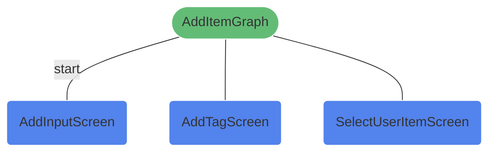
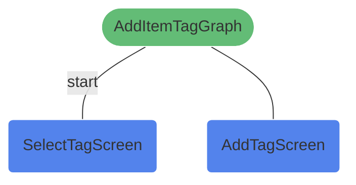

KeyVault 应用采用 Compose Destinations 实现导航管理，将整个导航结构划分为一个根导航图和两个子导航图，各页面间通过指定的导航关系实现跳转。

## 根导航图

根导航图包含应用的所有核心页面，是应用的主导航入口，`MainScreen` 为根导航图的起始页面。

```mermaid
graph TD
    root(["RootGraph"]) -- "start" --- main_screen("MainScreen")
    root(["RootGraph"]) --- add_item_screen("AddItemScreen")
    root(["RootGraph"]) --- add_item_tag_screen("AddItemTagScreen")
    root(["RootGraph"]) --- add_tag_item_screen("AddTagItemScreen")
    root(["RootGraph"]) --- root/add_tag_screen("AddTagScreen")
    root(["RootGraph"]) --- auth_screen("AuthScreen")
    root(["RootGraph"]) --- dark_mode_screen("DarkModeScreen")
    root(["RootGraph"]) --- info_screen("InfoScreen")
    root(["RootGraph"]) --- init_screen("InitScreen")
    root(["RootGraph"]) --- item_info_screen("ItemInfoScreen")
    root(["RootGraph"]) --- item_list_screen("ItemListScreen")
    root(["RootGraph"]) --- modify_auth_screen("ModifyAuthScreen")
    root(["RootGraph"]) --- select_expiry_screen("SelectExpiryScreen")
    root(["RootGraph"]) --- root/select_user_item_screen("SelectUserItemScreen")
    root(["RootGraph"]) --- tag_item_list_screen("TagItemListScreen")
    root(["RootGraph"]) --- tag_list_screen("TagListScreen")
    root(["RootGraph"]) --- verify_screen("VerifyScreen")

    classDef destination fill:#5383EC,stroke:#ffffff;
    class add_item_screen,add_item_tag_screen,add_tag_item_screen,root/add_tag_screen,auth_screen,dark_mode_screen,info_screen,init_screen,item_info_screen,item_list_screen,main_screen,modify_auth_screen,select_expiry_screen,root/select_user_item_screen,tag_item_list_screen,tag_list_screen,verify_screen destination;
    classDef navgraph fill:#63BC76,stroke:#ffffff;
    class root navgraph;
```

主要页面说明如下

- **MainScreen**：应用主页面，包含 `HomeScreen`（首页）和 `SettingScreen`（设置页）两个子页面，通过底部导航栏切换
- **InitScreen**：首次使用应用时的初始化页面，用于设置初始密钥和过期时间
- **VerifyScreen**：密钥验证页面，每次打开应用或超时后需要验证密钥
- **AddItemScreen**：添加密钥信息的入口页面，会跳转到对应的子导航图
- **AuthScreen**：密钥管理页面，支持修改密钥、调整过期时间和重置应用
- **TagListScreen**：标签管理页面，支持标签的增删改查操作

## 子导航图：密钥管理

用于处理添加密钥信息的完整流程，`AddInputScreen` 为该子导航图的起始页面。

页面说明如下

- **AddInputScreen**：添加密钥信息的主页面，可输入名称、账号、密码等信息
- **AddTagScreen**：添加标签页面，用于为当前密钥信息创建新标签
- **SelectUserItemScreen**：选择关联用户条目页面，用于建立条目间的关联关系

## 子导航图：标签管理

用于处理为密钥信息添加标签的相关流程，`SelectTagScreen` 为该子导航图的起始页面。

页面说明如下

- **SelectTagScreen**：标签选择页面，可从已有标签中选择需要关联的标签
- **AddTagScreen**：添加标签页面，用于创建新标签并关联到当前密钥信息

## 过渡动画

所有页面间的导航均采用滑动过渡动画（`SlideTransitions`），具体表现为：

- 前进导航：页面从右侧滑入，左侧滑出
- 返回导航：页面从左侧滑入，右侧滑出
- 动画时长：300ms

其中 `AddItemScreen` 采用底部弹窗样式（`DestinationStyleBottomSheet`），从屏幕底部滑入。
