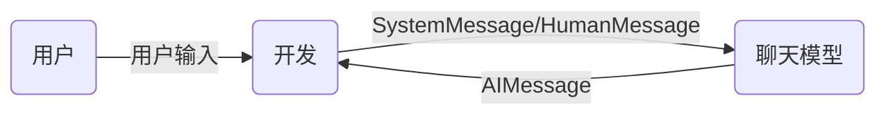
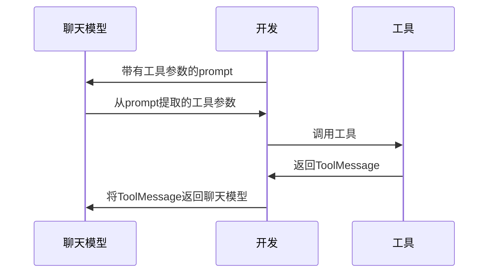

## 基本概念

LangChain 是一个用于开发基于 LLM 应用的框架，LangChain 由以下包构成

- langchain-core：包含核心组件
- langchain：包含了通用的模型、链等组件
- langchain-community：由社区维护，包含第三方集成
- langchain-\*：langchain 将一些流行的集成，如 openai，单独拆分到各自的包中
- langgraph：提供了用于创建常见类型代理的高级接口，以及用于组合自定义流程的低级 API
- langserve：一个将 LangChain 链部署为 REST API 的包
- LangSmith：一个开发者平台，让你能够调试、测试、评估和监控 LLM 应用程序

## LCEL

langchain 表达式（LCEL），langchain 通过重载 `__or__` 运算符和 `__ror__` 运算符实现了通过 `|` 来组合各个组件，如模板、模型、解析器等

e.g.

```python
from langchain_core.output_parsers import StrOutputParser
from langchain_core.prompts import ChatPromptTemplate
from langchain_openai import ChatOpenAI

# 定义提示模板
prompt = ChatPromptTemplate.from_template("回答用户关于{topic}的问题：{question}")

# 初始化模型
model = ChatOpenAI()

# 定义输出解析器
output_parser = StrOutputParser()

# 使用管道符组合链：提示模板 → 模型 → 输出解析器
chain = prompt | model | output_parser

# 调用链并输出结果
result = chain.invoke({"topic": "科技", "question": "量子计算的未来发展"})
print(result)  # 输出解析后的字符串结果
```

### Runnable

langchain 中定义了 `Runnable` 协议，许多组件（如模板、LLM、解析器、检索器等）都实现了 `Runnable` 协议，langchain 基于 `Runnable` 协议来构建 LCEL 链

`Runnable` 类是 langchain 链的核心类，langchain 核心类图如下


`Runnable` 类部分定义如下

```python
class Runnable(Generic[Input, Output], ABC):
    """A unit of work that can be invoked, batched, streamed, transformed and composed.
     Key Methods
     ===========
    * invoke/ainvoke: Transforms a single input into an output.
    * batch/abatch: Efficiently transforms multiple inputs into outputs.
    * stream/astream: Streams output from a single input as it's produced.
    * astream_log: Streams output and selected intermediate results from an input.
    """
    def __or__() -> RunnableSerializable[Input, Other]:
        """Compose this runnable with another object to create a RunnableSequence."""
        return RunnableSequence(self, coerce_to_runnable(other))
    def __ror__() -> RunnableSerializable[Other, Output]:
        """Compose this runnable with another object to create a RunnableSequence."""
        return RunnableSequence(coerce_to_runnable(other), self)
```

`Runnable` 类包含的核心方法如下，以 a 开头的方法为异步方法

-   `invoke`/`ainvoke`：简单地将输入转换为输出，即调用
-   `batch`/`abatch`：将多个输入转换为输出
-   `stream`/`astream`：流式调用
-   `astream_log`：在异步流式调用的过程返回中间结果

### runnables 包

runnables 包中包含了 LCEL 链流程控制的 `Runnable` 实现类

**RunnablePassthrough**

`RunnablePassthrough` 直接将输入传递到输出，不作任何处理，适用于需要向原始输入添加额外信息的情况

**RunnableSequence**

`RunnableSequence` 是最重要的一个类，可以直接创建可运行的对象，并且将对象的输出作为下一个对象的输入

使用 `RunnableLambda` 类，可以直接将一个函数转换为 `RunnableSequence`

```python
from langchain_core.runnables import RunnableLambda

def add_one(x: int) -> int:
    return x + 1

def mul_two(x: int) -> int:
    return x * 2

runnable_1 = RunnableLambda(add_one)
runnable_2 = RunnableLambda(mul_two)
sequence = runnable_1 | runnable_2
# Or equivalently:
# sequence = RunnableSequence(first=runnable_1, last=runnable_2)
sequence.invoke(1)
await sequence.ainvoke(1)

sequence.batch([1, 2, 3])
await sequence.abatch([1, 2, 3])
```

**RunnableParallel**

支持 langchain 的并行执行分支，将一个输入分发到独立的多个串行分支中进行处理，返回一个结果 map

```python
from langchain_core.runnables import RunnableLambda

def add_one(x: int) -> int:
    return x + 1

def mul_two(x: int) -> int:
    return x * 2

def mul_three(x: int) -> int:
    return x * 3

runnable_1 = RunnableLambda(add_one)
runnable_2 = RunnableLambda(mul_two)
runnable_3 = RunnableLambda(mul_three)

sequence = runnable_1 | {  # this dict is coerced to a RunnableParallel
    "mul_two": runnable_2,
    "mul_three": runnable_3,
}

sequence.invoke(1)  # {"mul_two": 4, "mul_three": 6}
```

**RunnableBranch**

`RunnableBranch` 实现了分支判断

```python
from langchain_core.runnables import RunnableBranch

branch = RunnableBranch(
    (lambda x: isinstance(x, str), lambda x: x.upper()),
    (lambda x: isinstance(x, int), lambda x: x + 1),
    (lambda x: isinstance(x, float), lambda x: x * 2),
    lambda x: "goodbye",
)

branch.invoke("hello") # "HELLO"
branch.invoke(None) # "goodbye"

# 等同于以下语句
def branch(x):
    if isinstance(x, str):
        return x.upper()
    elif isinstance(x, int):
        return x + 1
    elif isinstance(x, float):
        return x * 2
    else:
        return "goodbye"
```

**RunnableEach**

`RunnableEach` 用于接受多个输入，将每个输入逐个输入到链中

```python
from langchain_core.runnables.base import RunnableEach
from langchain_openai import ChatOpenAI
from langchain_core.prompts import ChatPromptTemplate
from langchain_core.output_parsers import StrOutputParser
prompt = ChatPromptTemplate.from_template("Tell me a short joke about{topic}")
model = ChatOpenAI()
output_parser = StrOutputParser()
runnable = prompt | model | output_parser

runnable_each = RunnableEach(bound=runnable)  # bound参数绑定处理输入的链
output = runnable_each.invoke([
    {'topic':'Computer Science'},
    {'topic':'Art'},
    {'topic':'Biology'}
])  # 每个元素都作为链的输入
print(output)  # noqa: T201
```

## 基本组件

组件部分用法详见：[使用指南](https://www.langchain.com.cn/docs/how_to/)

### 聊天模型

使用一系列消息作为输入并返回聊天消息作为输出的语言模型，聊天模型支持为对话消息分配不同的角色，有助于区分来自 AI、用户和系统消息等指令的消息

聊天模型类以 Chat 开头，与基础模型区分，langchain 也支持基础模型，但通常模型较旧，因此通常只使用聊天模型

构建聊天模型通常有以下参数

- `model`：模型名称
- `temperature`：采样温度
- `timeout`：请求超时
- `max_tokens`：生成的最大令牌数
- `stop`：默认停止序列
- `max_retries`：请求重试的最大次数
- `api_key`：大模型供应商的 API 密钥
- `base_url`：发送请求的端点

### 消息

聊天模型交互的内容通过消息封装，主要有 `SystemMessage`、`HumanMessage`、`AIMessage`、`ToolMessage`，每种消息都有 `role` 和 `content` 两个属性

- `HumanMessage`：输入 prompt
- `AIMessage`：输出 completion，其中的 `tool_calls` 属性表示模型调用工具的决策，为一个 `ToolCall` 列表，每个 `ToolCall` 包含以下属性
    - `name`：应该被调用的工具的名称
    - `args`：工具的参数
    - `id`：工具调用 id
- `SystemMessage`：系统 prompt
- `ToolMessage`：包含工具调用的结果，在消息列表中只能出现在填充了 `tool_calls` 属性的 `AIMessage` 之后，该消息包含以下重要属性
    - `content`：返回给模型的文本内容，用于解释工具执行的结果或上下文
    - `tool_call_id`：工具调用 id，与 `ToolCall.id` 对应
    - `artifact`：工具执行的具体结果（如文件、自定义对象等），这些结果不应该直接传递给模型，应该传递到下游组件进行处理

多轮对话中，消息的基本传递流程如下



### 提示词模板

构建提示词模板通过 `PromptTemplate` 类来实现，在模板中通过 `{variable}` 定义插值的变量，在调用模板时传入一个字典，其中包含参数键值对，如 `{"variable": value}`

通过字符串创建提示词模板

```python
from langchain_core.prompts import PromptTemplate

prompt_template = PromptTemplate.from_template("Tell me a joke about {topic}")

prompt_template.invoke({"topic": "cats"})
```

对于聊天消息，消息中包含 `role` 字段，表示角色名，创建方式与 `PromptTemplate` 相同

```python
from langchain.prompts import ChatMessagePromptTemplate

template = "May the {subject} be with you"

chat_message_prompt = ChatMessagePromptTemplate.from_template(role="Jedi", template=template)
chat_message_prompt.format(subject="force")
```

在构建消息列表提示词时，需要使用 `ChatPromptTemplate` 类

```python
from langchain_core.prompts import ChatPromptTemplate

prompt_template = ChatPromptTemplate.from_messages([
    ("system", "You are a helpful assistant"),
    ("user", "Tell me a joke about {topic}")
])

# format_prompt作用与invoke相同
prompt_template.invoke({"topic": "cats"})
```

使用消息占位符可以将消息插入到特定位置

```python
from langchain_core.prompts import ChatPromptTemplate, MessagesPlaceholder
from langchain_core.messages import HumanMessage

prompt_template = ChatPromptTemplate.from_messages([
    ("system", "You are a helpful assistant"),
    MessagesPlaceholder("msgs"),
    ("placeholder", "{msgs1}")  # 隐式消息占位
])

prompt_template.invoke({
    "msgs": [HumanMessage(content="hi!")],
    "msgs1": [HumanMessage(content="test")]
})
```

### 输出解析器

输出解析器获取模型的输出并将其转换为更适合下游任务的格式

langchain 支持以下解析器

| 名称 | 支持流式处理 | 有格式说明 | 输入类型 | 输出类型 | 描述 |
| --------------- | ------------ | ---------- | -------------- | -------------------- | ------------------------------------------------------------ |
| JSON | ✅ | ✅ | `str`、`消息` | JSON 对象 | 返回指定的 JSON 对象。您可以指定一个 Pydantic 模型，它将返回该模型的 JSON。可能是获取不使用函数调用的结构化数据的最可靠输出解析器。 |
| XML | ✅ | ✅ | `str`、`消息` | `dict` | 返回标签的字典。当需要 XML 输出时使用。与擅长编写 XML 的模型（如 Anthropic 的模型）一起使用。 |
| CSV  | ✅ | ✅ | `str`、`消息` | `List[str]` | 返回以逗号分隔的值的列表。|
| OutputFixing ||| `str`、`消息` || 包装另一个输出解析器。如果该输出解析器出错，则会将错误消息和错误输出传递给大型语言模型，并请求其修复输出。 |
| RetryWithError ||| `str`、`消息` || 包装另一个输出解析器。如果该输出解析器出错，则会将原始输入、错误输出和错误消息传递给大型语言模型，并请求其修复。与 OutputFixingParser 相比，这个还会发送原始说明。 |
| Pydantic || ✅ | `str`、`消息` | `pydantic.BaseModel` | 接受用户定义的 Pydantic 模型，并以该格式返回数据。|
| YAML || ✅ | `str`、`消息` | `pydantic.BaseModel` | 接受用户定义的 Pydantic 模型，并以该格式返回数据。使用 YAML 进行编码。 |
| PandasDataFrame || ✅ | `str`、`消息`、`dict` || 对于使用 pandas DataFrame 进行操作非常有用。|
| 枚举 || ✅ | `str`、`消息`、`Enum` || 将响应解析为提供的枚举值之一。|
| 日期时间        |              | ✅          | `str`、`消息`、`datetime.datetime`  || 将响应解析为日期时间字符串。|
| 结构化          |              | ✅          | `str`、`消息`、`Dict[str, str]`     || 一种输出解析器，返回结构化信息。它的功能不如其他输出解析器强大，因为它只允许字段为字符串。当您使用较小的 LLM 时，这可能会很有用。 |

### 文档

langchain 将文本内容封装成一个个文档对象（`Document` 对象），可以从多种数据源中加载文档，如 PDF、CSV、JSON、Web 页面等

`Document` 对象包含两个属性

- `page_content: str`：此文档的内容。目前仅为字符串
- `metadata: dict`：与此文档相关的任意元数据，可以跟踪文档 ID、文件名等

文档对象通过文档加载器获取，每个文档加载器都有一个 `load` 方法，调用该方法获取文档对象

```python
from langchain_community.document_loaders.csv_loader import CSVLoader

loader = CSVLoader(
    ...  # <-- Integration specific parameters here
)
data = loader.load()
```

获取文档对象后，需要对文档进行切分，以适应模型的 `max_tokens`，langchain 中提供了多种文档分割器，基本工作原理如下

1. 将文本拆分成小的、语义上有意义的块（通常是句子），可以自定义文本的拆分方式
2. 开始将这些小块组合成一个更大的块，直到达到某个大小（通过某个函数来衡量），可以自定义块大小的测量
3. 一旦达到该大小，将该块作为独立的文本片段，然后开始创建一个新的文本块，并保持一些重叠（以保持块之间的上下文）

对于通用文本，langchain 中通常使用 `RecursiveCharacterTextSplitter` 进行文本分割，它根据指定的字符列表进行分割，默认字符列表为 `['\n\n', '\n', ' ', '']`，根据字符数确定块大小

```python
from langchain_text_splitters import RecursiveCharacterTextSplitter

# Load example document
with open("state_of_the_union.txt") as f:
    state_of_the_union = f.read()

text_splitter = RecursiveCharacterTextSplitter(
    chunk_size=100,  # 块大小的最大值
    chunk_overlap=20,  # 块重叠的大小
    length_function=len,  # 确定块大小的函数
    is_separator_regex=False,  # 分隔符列表是否应被解释为正则表达式
)
texts = text_splitter.create_documents([state_of_the_union])
print(texts[0])
print(texts[1])
```

对于没有词边界的语言（如中文）进行文本分割，需要添加一些分隔符

```python
text_splitter = RecursiveCharacterTextSplitter(
    separators=[
        "\n\n", "\n", " ", ".", ",", "",
        "\u200b",  # Zero-width space
        "\uff0c",  # Fullwidth comma
        "\u3001",  # Ideographic comma
        "\uff0e",  # Fullwidth full stop
        "\u3002",  # Ideographic full stop
    ],
    # Existing args
)
```

### 聊天历史存储

聊天历史存储提供了访问聊天历史的能力，可以将早期对话引入当前对话，langchain 中实现了聊天历史存储（截止 v0.2），在 langchain 的最新版本中推荐使用 langgraph 提供的持久化能力

`RunnableWithMessageHistory` 类可以包装任何链，跟踪链的输入和输出，并将它们作为消息附加到消息存储

消息存储通过 `BaseChatMessageHistory` 类实现，langchain 内置了多种类型的实现类，如 SQL、Redis 等


构造 `RunnableWithMessageHistory` 需要以下参数

- `chain`：被包装的链
- `get_session_history`：一个函数，函数接受 `sessihon_id` 字符串，返回 `BaseChatMessageHistory` 类型对象
- `input_messages_key`：当链的输入为一个字典时，指定该参数为值是消息列表的键
- `output_messages_key`：当链的输出为一个字典时，指定该参数为值是消息列表的键
- `history_messages_key`：当链的输入为一个字典时，指定该参数，以该参数为键保存历史消息
- `history_factory_config`：该参数接受 `ConfigurableFieldSpec` 对象列表，配置 `get_session_history` 的参数

e.g.

```python
from langchain_community.chat_message_histories import ChatMessageHistory
from langchain_community.chat_models import ChatZhipuAI
from langchain_core.chat_history import BaseChatMessageHistory
from langchain_core.prompts import ChatPromptTemplate, MessagesPlaceholder
from langchain_core.runnables.history import RunnableWithMessageHistory


stlore = {}  # 使用全局存储

def get_by_session_id(session_id: str) -> BaseChatMessageHistory:
    if session_id not in store:
        store[session_id] = ChatMessageHistory()
    return store[session_id]


prompt = ChatPromptTemplate.from_messages([
    ("system", "You're an assistant who's good at {ability}"),
    MessagesPlaceholder(variable_name="history"),  # 历史记录
    ("human", "{question}"),  # 消息列表
])

chain = prompt | model

chain_with_history = RunnableWithMessageHistory(
    chain,
    get_by_session_id,
    input_messages_key="question",  # 链的输入中值为消息列表的键
    history_messages_key="history",  # 链的输入中值为历史记录的键
)

# 输入消息列表和其他值，config参数指定传入get_by_session_id函数的参数
result = chain_with_history.invoke(
    {"question": "What does cosine mean?"， "ability": "math"},
    config={"configurable": {"session_id": "foo"}}
)
```

当 `get_session_history` 函数接受多个参数时，需要设置 `history_factory_config`，设置参数定义

```python
store = {}

def get_session_history(user_id: str, conversation_id: str) -> BaseChatMessageHistory:
    if (user_id, conversation_id) not in store:
        store[(user_id, conversation_id)] = ChatMessageHistory()
    return store[(user_id, conversation_id)]


with_message_history = RunnableWithMessageHistory(
    chain,
    get_session_history=get_session_history,
    input_messages_key="question",
    history_messages_key="history",
    history_factory_config=[
        ConfigurableFieldSpec(
            id="user_id",
            annotation=str,
            name="User ID",
            description="Unique identifier for the user.",
            default="",
            is_shared=True,
        ),
        ConfigurableFieldSpec(
            id="conversation_id",
            annotation=str,
            name="Conversation ID",
            description="Unique identifier for the conversation.",
            default="",
            is_shared=True,
        ),
    ],
)
```

## 向量存储与检索

langchain 支持将文本嵌入为向量，通过向量之间的距离计算文本的相似度，实现相似文本搜索的功能，该功能主要由嵌入模型、向量存储和检索器实现

### 嵌入模型

嵌入模型将文本转换为包含语义的向量，从而进行诸如搜索其他在意义上最相似的文本等操作

langchain 中使用 `Embeddings` 类封装不同嵌入模型供应商（如 OpenAI、Hugging Face 等）的接口

嵌入模型包含两个方法

- `embed_documents`：用于嵌入文档，参数为一个字符串列表
- `embed_query`：用于嵌入查询，参数为单个文本

```python
embeddings = embeddings_model.embed_documents([
    "Hi there!",
    "Oh, hello!",
    "What's your name?",
    "My friends call me World",
    "Hello World!"
])
len(embeddings), len(embeddings[0])  # (5, 1536)
```

### 向量存储

存储和搜索非结构化数据的最常见方法之一是将其嵌入并存储生成的嵌入向量，然后在查询时嵌入非结构化查询并检索与嵌入查询最相似的嵌入向量

langchain 中集成了一些优秀的开源向量存储，主要有 Chroma、FAISS、Lance

```python
from langchain_chroma import Chroma

db = Chroma.from_documents(documents, OpenAIEmbeddings())
```

所有的向量存储都包含 `similarity_search` 方法，用于文本相似性搜索

```python
query = "What did the president say about Ketanji Brown Jackson"
docs = db.similarity_search(query)  # 返回最相似的Document对象
print(docs[0].page_content)
```

使用 `similarity_search_by_vector` 方法可以直接使用向量进行相似性搜索

```python
embedding_vector = OpenAIEmbeddings().embed_query(query)
docs = db.similarity_search_by_vector(embedding_vector)
print(docs[0].page_content)
```

向量存储的所有操作方法都有异步版本，以 a 开头

```python
docs = await db.asimilarity_search(query)
```

### 检索器

检索器是搜索操作更加抽象的接口，给定非结构化的查询，返回文档，检索器不止可以从向量存储中搜索，也可以从其他数据源中搜索

```python
from langchain_community.document_loaders import TextLoader
from langchain_community.vectorstores import FAISS
from langchain_openai import OpenAIEmbeddings
from langchain_text_splitters import CharacterTextSplitter

# 加载文档
loader = TextLoader("state_of_the_union.txt")
documents = loader.load()

# 文本分割
text_splitter = CharacterTextSplitter(chunk_size=1000, chunk_overlap=0)
texts = text_splitter.split_documents(documents)

# 创建向量存储
embeddings = OpenAIEmbeddings()
vectorstore = FAISS.from_documents(texts, embeddings)

# 检索，进行相似性搜索
retriever = vectorstore.as_retriever()
docs = retriever.invoke("what did the president say about ketanji brown jackson?")
```

创建检索器时，可以进行一些配置

```python
# 指定使用最大边际相关性搜索
retriever = vectorstore.as_retriever(search_type="mmr")
# 指定使用相似性得分阈值搜索
retriever = vectorstore.as_retriever(
    search_type="similarity_score_threshold", 
    search_kwargs={"score_threshold": 0.5}
)
# 指定返回文档数量
retriever = vectorstore.as_retriever(search_kwargs={"k": 1})
```

## 工具

工具（Tool）是一种**输入由模型产生，输出返回给模型的程序**

一个工具由以下属性组成

- `name`：工具名称
- `description`：工具的描述
- `args_schema`：通过 `pydantic.BaseModel` 定义工具输入
- `return_direct`：仅与代理相关。当为 True 时，在调用给定工具后，代理将停止并直接将结果返回给用户
- 可执行对象

工具设计原则：工具尽量具有明确的名称、描述和参数列表，功能单一的工具相比复杂工具更容易被模型使用

### 创建工具

langchain 支持通过函数、`Runnable`、`BaseTool` 三种方式来创建工具

**从函数创建工具**

从函数创建工具，使用 `@tool` 装饰器

```python
from langchain_core.tools import tool


@tool
def multiply(a: int, b: int) -> int:
    """Multiply two numbers."""
    return a * b


# 异步版本
@tool
async def amultiply(a: int, b: int) -> int:
    """Multiply two numbers."""
    return a * b


# @tool支持解析注释、嵌套模式
@tool
def multiply_by_max(
    a: Annotated[str, "scale factor"],
    b: Annotated[List[int], "list of ints over which to take maximum"],
) -> int:
    """Multiply a by the maximum of b."""
    return a * max(b)


print(multiply.name)  # multiply
print(multiply.description)  # Multiply two numbers.
print(multiply.args)  # {'a': {'title': 'A', 'type': 'integer'}, 'b': {'title': 'B', 'type': 'integer'}}
```

也可直接在 `@tool` 中定义工具

```python
from pydantic import BaseModel, Field

# 通过Pydantic定义，也可通过TypedDict定义
class CalculatorInput(BaseModel):
    a: int = Field(description="first number")
    b: int = Field(description="second number")


@tool("multiplication-tool", args_schema=CalculatorInput, return_direct=True)
def multiply(a: int, b: int) -> int:
    """Multiply two numbers."""
    return a * b


print(multiply.name)
print(multiply.description)
print(multiply.args)
print(multiply.return_direct)
```

使用 `StructuredTool` 类可以提供更多的配置

```python
class CalculatorInput(BaseModel):
    a: int = Field(description="first number")
    b: int = Field(description="second number")


def multiply(a: int, b: int) -> int:
    """Multiply two numbers."""
    return a * b


async def amultiply(a: int, b: int) -> int:
    """Multiply two numbers."""
    return a * b


calculator = StructuredTool.from_function(
    func=multiply,
    name="Calculator",
    description="multiply numbers",
    args_schema=CalculatorInput,
    return_direct=True,
    coroutine=amultiply
)

print(calculator.invoke({"a": 2, "b": 3}))
print(calculator.name)
print(calculator.description)
print(calculator.args)
```

**从 Runnable 创建工具**

对于任意的 `Runnable` 实现类，可以通过 `as_tool` 方法将其转换为一个工具

```python
from langchain_core.language_models import GenericFakeChatModel
from langchain_core.output_parsers import StrOutputParser
from langchain_core.prompts import ChatPromptTemplate

prompt = ChatPromptTemplate.from_messages(
    [("human", "Hello. Please respond in the style of {answer_style}.")]
)

# Placeholder LLM
llm = GenericFakeChatModel(messages=iter(["hello matey"]))

chain = prompt | llm | StrOutputParser()

as_tool = chain.as_tool(
    name="Style responder", 
    description="Description of when to use tool."
)
as_tool.args
```

**从 BaseTool 创建工具**

BaseTool 提供了定义工具的最大控制

```python
from typing import Optional, Type

from langchain_core.callbacks import (
    AsyncCallbackManagerForToolRun,
    CallbackManagerForToolRun,
)
from langchain_core.tools import BaseTool
from pydantic import BaseModel


# 定义args_schema
class CalculatorInput(BaseModel):
    a: int = Field(description="first number")
    b: int = Field(description="second number")


# BaseTool是一个Pydantic类，因此属性都需要类型标记
class CustomCalculatorTool(BaseTool):
    name: str = "Calculator"
    description: str = "useful for when you need to answer questions about math"
    args_schema: Type[BaseModel] = CalculatorInput
    return_direct: bool = True

    # 同步执行
    def _run(
        self, a: int, b: int, run_manager: Optional[CallbackManagerForToolRun] = None
    ) -> str:
        """Use the tool."""
        return a * b

    # 异步执行
    async def _arun(
        self,
        a: int,
        b: int,
        run_manager: Optional[AsyncCallbackManagerForToolRun] = None,
    ) -> str:
        """Use the tool asynchronously."""
        # If the calculation is cheap, you can just delegate to the sync implementation
        # as shown below.
        # If the sync calculation is expensive, you should delete the entire _arun method.
        # LangChain will automatically provide a better implementation that will
        # kick off the task in a thread to make sure it doesn't block other async code.
        return self._run(a, b, run_manager=run_manager.get_sync())
```

### 使用异步工具

在创建异步工具时，需要注意以下事项

- LangChain 默认提供异步实现
- 若在异步代码库中工作，应该创建异步工具而不是同步工具，以避免因该线程而产生小的开销
- 若需要同步和异步实现，使用 `StructuredTool` 或从 `BaseTool` 子类化
- 同时实现同步和异步时，若同步代码运行速度较快，应覆盖默认异步实现并直接调用同步函数，否则应使用默认异步实现
- 不能将同步 `invoke` 与异步工具一起使用

### 处理工具异常

langchain 中使用工具时产生异常，将抛出 `ToolException`，可以设置工具的 `handle_tool_error` 属性来控制如何处理异常

- 当 `handle_tool_error` 设置为 True 时，使用默认实现，返回一个错误信息字符串
- 当 `handle_tool_error` 设置为字符串时，将字符串作为错误信息返回
- 当 `handle_tool_error` 设置为函数时，函数作为异常处理器，接受一个 `ToolException` 类型的参数，返回错误信息字符串

### 返回工具的具体产物

在模型调用工具时，通常工具返回的是一个文本字符串，若需要返回工具产生的文件、自定义对象等产物，则需要工具返回 `ToolMessage`，其中的 `content` 属性包含了返回给模型的文本字符串，`artifact` 属性包含了工具输出的具体产物

返回 `ToolMessage`，需要进行以下步骤

1. 设置工具的 `response_format` 属性为 `"content_and_artifact"`，同时在工具执行代码中返回一个元组，其中第一个元素为 content，第二个元素为 artifact
2. 若手动调用工具，则需要传入完整的 `ToolCall` 定义

```python
import random
from typing import List, Tuple

from langchain_core.tools import tool


@tool(response_format="content_and_artifact")
def generate_random_ints(min: int, max: int, size: int) -> Tuple[str, List[int]]:
    """Generate size random ints in the range [min, max]."""
    array = [random.randint(min, max) for _ in range(size)]
    content = f"Successfully generated array of {size} random ints in [{min}, {max}]."
    return content, array

# 传入ToolCall完整定义
generate_random_ints.invoke({
    "name": "generate_random_ints",
    "args": {"min": 0, "max": 9, "size": 10},
    "id": "123",  # required
    "type": "tool_call",  # required
})
```

### 与聊天模型交互

**通过聊天模型产生工具参数**

首先需要使用聊天模型，从查询文本字符串提取出工具调用的参数，支持工具调用的模型包含一个 `bind_tools` 方法，接受一个工具 `args_schema` 的列表

调用设置了工具的聊天模型后，输出的 `AIMessage` 中的 `tool_calls` 属性会包含可被输入到工具的参数，若模型输出解析失败，则记录在 `invalid_tool_cahlls` 属性中，使用 `InvalidToolCall` 类封装

```python
from pydantic import BaseModel, Field

class AddArgs(BaseModel):
    """Add two integers."""

    a: int = Field(..., description="First integer")
    b: int = Field(..., description="Second integer")
    
    
class MultiplyArgs(BaseModel):
    """Multiply two integers."""

    a: int = Field(..., description="First integer")
    b: int = Field(..., description="Second integer")
    
# 可传入参数模型类也可直接传入工具函数，若传入dict，则需要符合openai、Anthropic格式
llm_with_tools = llm.bind_tools([AddArgs, MultiplyArgs])
query = "What is 3 * 12?"
llm_with_tools.invoke(query)  # 返回AIMessage，在tool_calls中包含工具的参数
```

使用 `PydanticToolsParser` 解析器，可以直接从 AIMessage 中提取参数，转换为 Pydantic 模式类

```python
from langchain_core.output_parsers import PydanticToolsParser

chain = llm_with_tools | PydanticToolsParser(tools=[add, multiply])
chain.invoke(query)
```

**工具调用**

通过聊天模型产生参数后，手动调用工具执行，传入 `ToolCall` 时，工具可返回一个 `ToolMessage`，可直接添加到消息列表中

```python
from langchain_core.tools import tool

@tool
def add(a: int, b: int) -> int:
    """Adds a and b."""
    return a + b


@tool
def multiply(a: int, b: int) -> int:
    """Multiplies a and b."""
    return a * b


tools = {"AddArgs": add, "MultiplyArgs": multiply}

for tool_call in ai_msg.tool_calls:
    selected_tool = tools[tool_call["name"].lower()]
    # tool_call符合ToolCall模型
    # 此处将整个tool_call传入工具，工具才能返回ToolMessage，传入args只能返回结果
    tool_msg = selected_tool.invoke(tool_call)
    messages.append(tool_msg)
```

**将结果返回给模型**

将包含 `ToolMessage` 的消息列表返回给模型，模型将使用 `ToolMessage` 中的 `content` 属性

```python
llm_with_tools.invoke(messages)
```

聊天模型与工具的交互如下



### 第三方集成

langchain 中已经内置了一些第三方集成工具，可以直接调用

e.g. 调用 Wikipedia 工具

```python
from langchain_community.tools import WikipediaQueryRun
from langchain_community.utilities import WikipediaAPIWrapper

api_wrapper = WikipediaAPIWrapper(top_k_results=1, doc_content_chars_max=100)
tool = WikipediaQueryRun(api_wrapper=api_wrapper)

print(tool.invoke({"query": "langchain"}))
```

## 回调

langchain 支持在 LLM 应用程序的各个阶段进行挂钩，可以通过使用 API 中可用的 `callbacks` 参数来订阅回调事件，该参数接受一个回调处理器对象的列表

### 定义回调处理器

回调处理器分为同步和异步两个版本，同步回调处理器需要实现 `BaseCallbackHandler` 接口，异步回调处理器需要实现 `AsyncCallbackHandler` 接口，接口中包含多个回调事件方法，重写需要的回调事件方法

| 事件         | 事件触发                         | 关联方法              |
| ------------ | -------------------------------- | --------------------- |
| 聊天模型开始 | 当聊天模型开始时                 | `on_chat_model_start` |
| LLM 开始      | 当 LLM 开始时                      | `on_llm_start`        |
| LLM 新令牌    | 当 LLM 或聊天模型发出新令牌时      | `on_llm_new_token`    |
| LLM 结束     | 当一个大型语言模型或聊天模型结束 | `on_llm_end`          |
| LLM 错误     | 当一个大型语言模型或聊天模型出错 | `on_llm_error`        |
| 链开始       | 当一个链开始运行                 | `on_chain_start`      |
| 链结束       | 当一个链结束                     | `on_chain_end`        |
| 链错误       | 当一个链出错                     | `on_chain_error`      |
| 工具开始     | 当一个工具开始运行               | `on_tool_start`       |
| 工具结束     | 当一个工具结束                   | `on_tool_end`         |
| 工具错误     | 当一个工具出错                   | `on_tool_error`       |
| 代理动作     | 当一个代理采取行动               | `on_agent_action`     |
| 代理结束     | 当一个代理结束                   | `on_agent_finish`     |
| 检索器开始   | 当检索器开始时                   | `on_retriever_start`  |
| 检索器结束   | 当检索器结束时                   | `on_retriever_end`    |
| 检索器错误   | 当检索器发生错误时               | `on_retriever_error`  |
| 文本         | 当任意文本被运行时               | `on_text`             |
| 重试         | 当重试事件被触发时               | `on_retry`            |

e.g.

```python
from typing import Any, Dict, List

from langchain_core.callbacks import BaseCallbackHandler
from langchain_core.messages import BaseMessage
from langchain_core.outputs import LLMResult


class LoggingHandler(BaseCallbackHandler):
    def on_chat_model_start(
        self, serialized: Dict[str, Any], messages: List[List[BaseMessage]], **kwargs
    ) -> None:
        print("Chat model started")

    def on_llm_end(self, response: LLMResult, **kwargs) -> None:
        print(f"Chat model ended, response: {response}")

    def on_chain_start(
        self, serialized: Dict[str, Any], inputs: Dict[str, Any], **kwargs
    ) -> None:
        print(f"Chain {serialized.get('name')} started")

    def on_chain_end(self, outputs: Dict[str, Any], **kwargs) -> None:
        print(f"Chain ended, outputs: {outputs}")
```

### 设置回调

通常在以下位置设置回调

- 在最终调用 `invoke` 方法时设置回调：回调将作用在每个组件上

  ```python
  callbacks = [LoggingHandler()]
  llm = ChatAnthropic(model="claude-3-sonnet-20240229")
  prompt = ChatPromptTemplate.from_template("What is 1 + {number}?")
  
  chain = prompt | llm
  
  chain.invoke({"number": "2"}, config={"callbacks": callbacks})  # 设置回调
  ```

- 在组件的构造器中传入回调：回调仅作用在设置回调的组件上

  ```python
  callbacks = [LoggingHandler()]
  llm = ChatAnthropic(model="claude-3-sonnet-20240229", callbacks=callbacks)  # 设置回调
  prompt = ChatPromptTemplate.from_template("What is 1 + {number}?")
  
  chain = prompt | llm
  
  chain.invoke({"number": "2"})
  ```

- 在链的 `with_config` 方法中传入回调：回调将作用在该链的组件中

  ```python
  callbacks = [LoggingHandler()]
  llm = ChatAnthropic(model="claude-3-sonnet-20240229")
  prompt = ChatPromptTemplate.from_template("What is 1 + {number}?")
  
  chain = prompt | llm
  
  chain_with_callbacks = chain.with_config(callbacks=callbacks)  # 设置回调
  
  chain_with_callbacks.invoke({"number": "2"})
  ```
